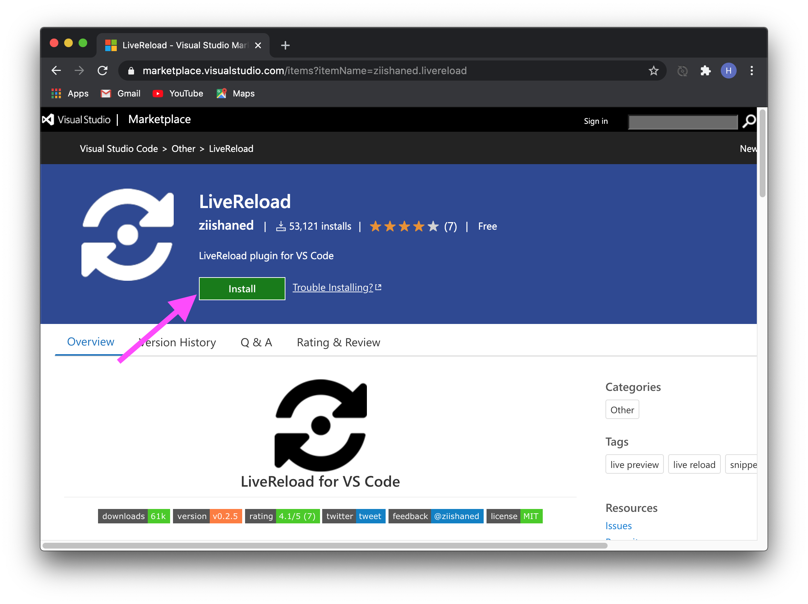
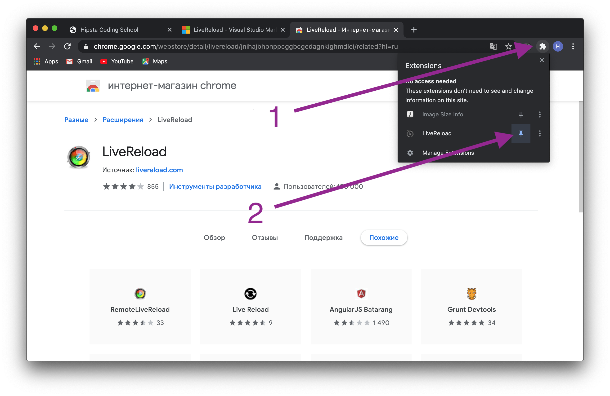
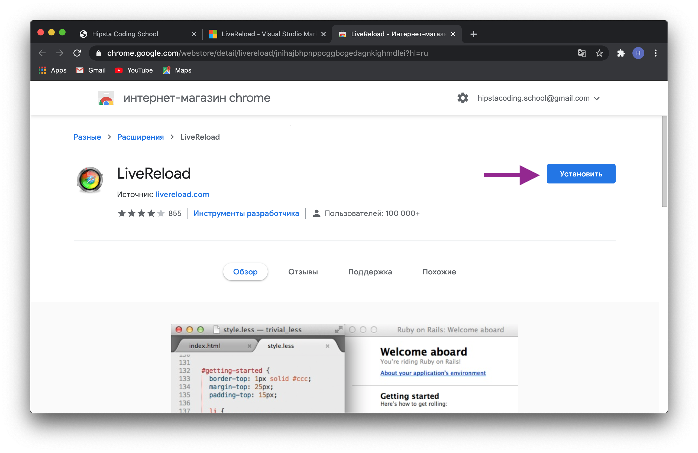
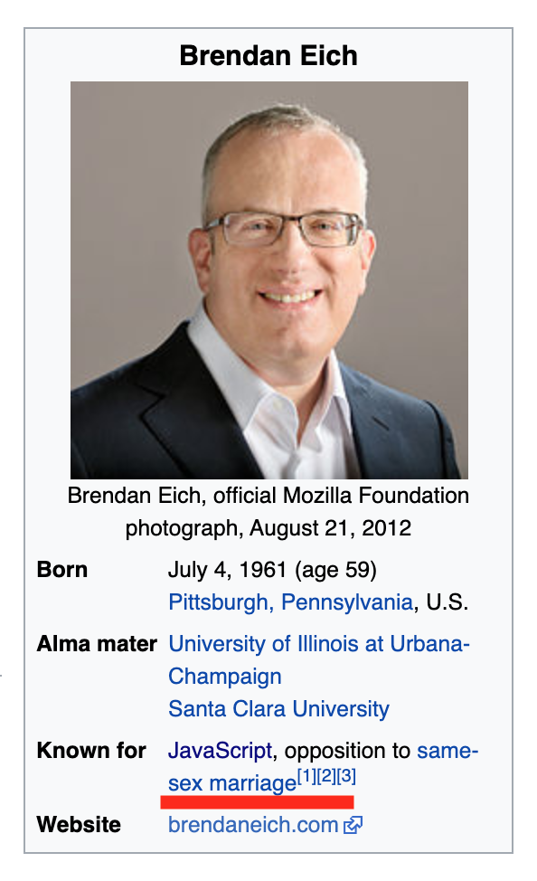
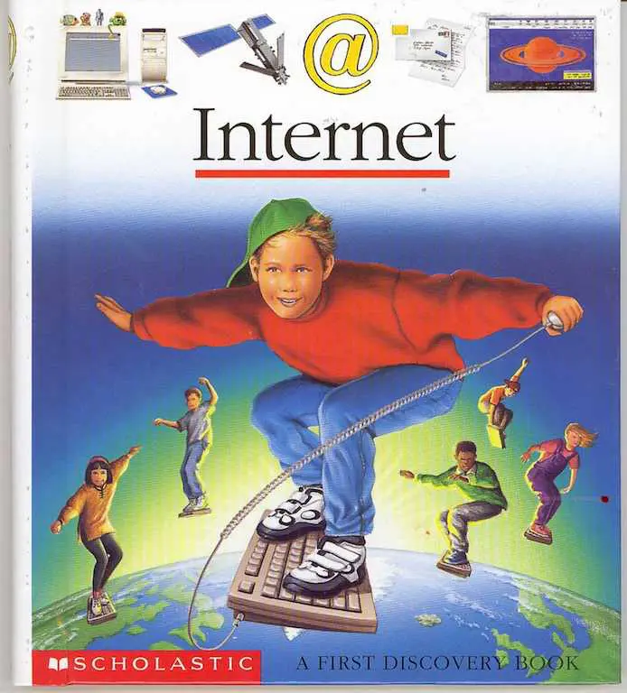
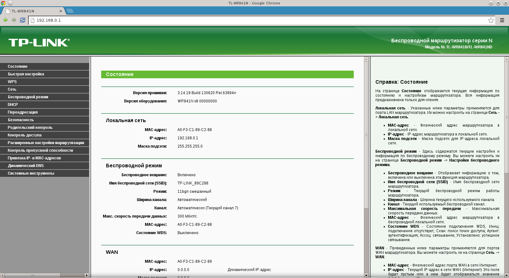
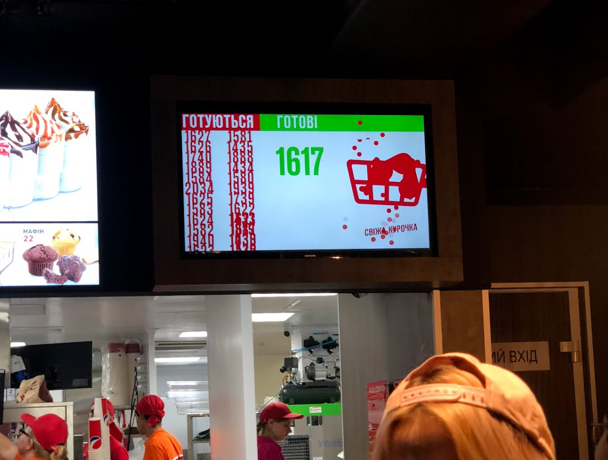

import background from "./images/background.jpg";
import { HtmlLogo } from "components/common/Icons.jsx";

<section
  data-background={background}
  data-background-size="cover"
  data-background-position="top left"
  data-background-opacity={0.1}
>
<section>

## Урок 1.

# Героическое вступление в

<HtmlLogo height="30vh" />

</section>
<section>

## А так же:

- История HTML и зачем он нужен
- Основные понятия
- Как редактировать HTML
- Выкладываем свою первую HTML страничку в интернет
- Изучаем первые HTML теги

</section>
</section>
<section>
<section>

### Часть 0.

## Подготовка к занятию

</section>
<section>

### Програмное обеспечение

Для работы нам понадобятся две програмы:

1. [Visual Studio Code ©](https://code.visualstudio.com/) - тут будем писать код.
2. [Google Chrome ©](https://www.google.com/chrome/) - тут будем смотреть на результат.

</section>
<section>

Обе программы поддерживают плагины от сторонних разработчиков

Чтобы вручную не перезагружать страницу, мы будем использовать плагин LiveReload © для 
[Visual Studio Code ©](https://marketplace.visualstudio.com/items?itemName=ziishaned.livereload) и
[Google Chrome ©](https://chrome.google.com/webstore/detail/livereload/jnihajbhpnppcggbcgedagnkighmdlei?hl=ru).

Для начала нужно просто их установить.

</section>
<section>

### GitHub

Я называю эт сооциальной сетью для программистов, где вместо фоточек и постов показывается ваш код. Для начала нужно просто [зарегестрироваться](https://github.com/), а так же при желании добавить [меня](https://github.com/xlwknx) в друзья и поставить лайк (звездочку) [сайту школы](https://github.com/HipstaCodingSchool/hipsta-home-web).

</section>
</section>
<section>
<section>

### Часть 1.

## История HTML

</section>
<section>

### 1990 год

- Британец Тимоти Джон Бернерс-Ли в Женевском ЦЕРНе изобрел первый в мире браузер, который назывался **World Wide Web** (сокращенно **WWW**).
  

</section>
<section>

### 1991 год

<ul>
  <li className="fragment">
Этот же кент изобретает язык гипертекстовой разметки, он же HyperText Markup Language, он же HTML, предназначенный для разметки и оформления документов World Wide Web.
  </li>
  <li className="fragment">

В этом году появляется первый в мире [интернет сайт](http://info.cern.ch/hypertext/WWW/TheProject.html).
  </li>
</ul>

</section>
<section>

### Первая браузерная война
#### 1995-1999

Netscape vs Internet Explorer

</section>
<section>

- **1995** В Netscape работник Brandan Eich создал JavaScript за 10 дней и назвал его Mocha
- **1996** Microsoft внедрили в Intenet Explorer язык стилей CSS
- **1997** Microsoft добавили Internet Explorer в Windows
- **1999** Internet Explorer вытеснил Netscape из рынка

</section>
<section>

### Вторая браузерная война или "Браузерный зоопарк"
#### 2005-2015

Internet explorer vs:

- Netscape, который стал Mozilla Firefox
- Apple Safari
- Opera Mini 
- Google Chrome

</section>
</section>
<section>
<section>

### Зачем и кому нужен HTML?

</section>
<section>

#### Front-End Разработчики

Fron-End'еры должны знать HTML и CSS досконально. Разработка на Front-End выглядит следующим образом:
- Строится структура документа из HTML.
- Добавляется оформление с помощью CSS.
- Для интерактивных компонентов пишется код на JavaScript.

</section>
<section>

#### Все остальные разработчики

HTML все еще самый лучший простой, а порой и единственный способ создать пользовательский интерфейс.

</section>
<section>

#### UI/UX Дизайнеры

Любой хороший UI/UX Дизайнер должен знать как работает HTML и CSS чтобы делать правильные интерфейсы. Так же дизайнер, который умеет верстать будет оцениваться дороже на рынке труда.

</section>
<section>

#### SEO специалисты

Для клиентской поисковой оптимизации необходимо править HTML теги, хоть и порой не напрямую.

</section>
<section>

#### Маркетологи

Маркетологи как правило его не знают, но каждый день имеют дело с email'ами, которые написаны на HTML, а так же сервисами, которые встраиваются на сайт через HTML (например Google Analytics), поэтому постоянно просят разработчиков помочь им с этим. Имея знания о том, как работает HTML они могут делать это сами и тем самым повысить свою стоимость на рынке.

</section>
<section>

#### Где можно увидеть HTML

</section>
</section>
