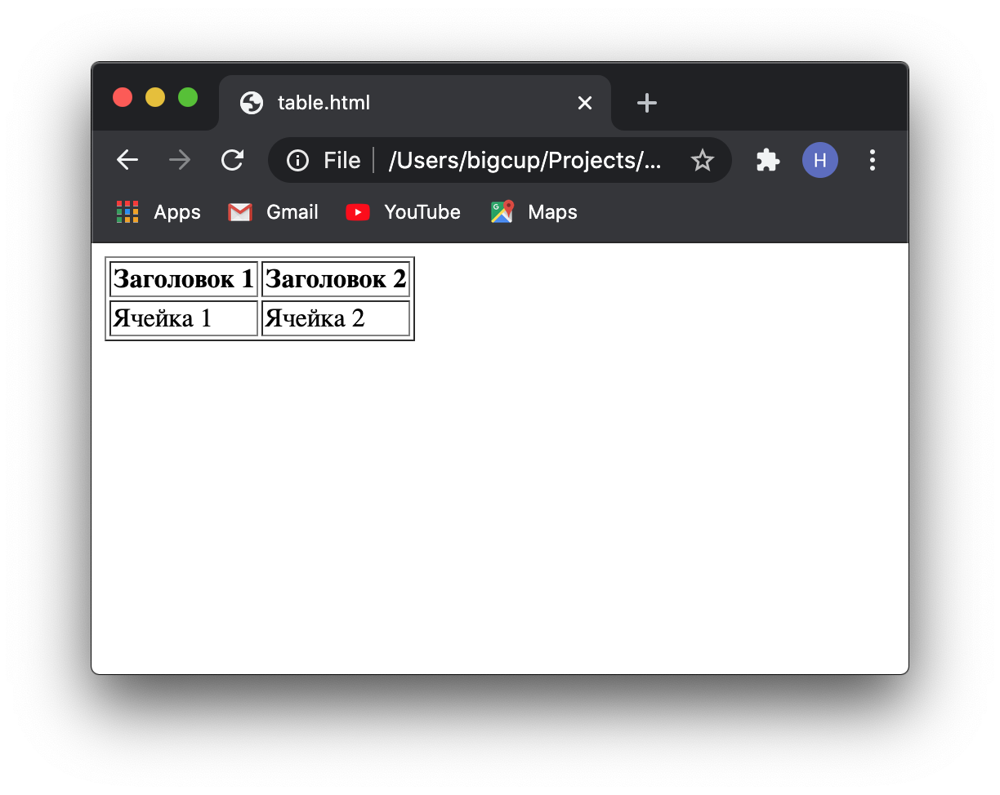

import tableHtml from "./snippets/table.html";
import background from "./images/background.jpg";

<section
  data-background={background}
  data-background-size="cover"
  data-background-position="top left"
  data-background-opacity={0.1}
>


<section>


## Урок 2.

# Картинки и таблицы

</section>
<section>


## А так же:

- Исповедимые пути в HTML
- Поддержка разных форматов изображений
- Олдскульная табличная верстка
- Пишем HTML в 10 раз быстрее с Emmet

</section>
</section>
<section data-auto-animate>


## Картинки

```html [1-7]

```

</section>
<section data-auto-animate>
<section data-auto-animate>


## Альтернативный текст

```html [2]

```

</section>


<section>


</section>


<section>


Хоть аттрибут **`alt`** опционален, важно добовлять его для сценариев:

- картинка не загрузилась
- некорректный путь
- включена экономия трафика
- человек использует програмное чтение с экрана
- поисковый робот индексирует страницу

</section>
</section>
<section>
<section>


## Изначальные размеры

```html [3,4]

```

</section>
<section>


Картинку нужно заранее уменьшить до максимального отображаемого размера и при необходимости сжать.
Аттрибуты `width` и `height` должны соотвествовать размеру изображения (например, открыть в браузере).

</section>
<section>


<div className="r-stack">


<div data-fragment-index={1} class="fragment fade-out">


#### **Лайфхак**

### Как узнать размер картинки?

</div>


<div data-fragment-index={1} class="fragment fade-in-then-out">


Установить расширение [Image Size Info](https://chrome.google.com/webstore/detail/image-size-info/oihdhfbfoagfkpcncinlbhfdgpegcigf)


</div>


<div class="fragment fade-in-then-out">
Открыть расрешения Image Size Info


</div>


<div class="fragment fade-in-then-out">
Разрешить использовать локальные файлы


</div>


<div class="fragment fade-in-then-out">


Поменять формат отображения на

```
width=\"{W}\" height=\"{H}\"
```


</div>


<div class="fragment fade-in-then-out full-screen">


`ПКМ` -> View Info


</div>
<div class="fragment fade-in">


Voila, теперь мы всегда можем копировать размеры в аттрибуты


</div>


</div>
</section>
</section>
<section>
<section>


## Пути в HTML

```html [5]

```
</section>
<section>

#### Термин

### URL 

### (_англ. Uniform Resource Locator_)

<div className="fragment">

Если кратко - это вот этот вот адрес:


</div>

</section>
<section>


**URL**  - это адрес, который выдан уникальному ресурсу в интернете.
Такими ресурсами могут быть HTML-страница, CSS-файл, изображение и т.д.

</section>
<section>


### Структура URL

<pre className="hljs">
  <span className="fragment highlight-current-blue" data-fragment-index={1}>
    https://
  </span>
  <span className="fragment highlight-current-blue" data-fragment-index={2}>
    hipstacoding.school
  </span>
  <span className="fragment highlight-current-blue" data-fragment-index={3}>
    :80
  </span>
  <span className="fragment highlight-current-blue" data-fragment-index={4}>
    /images/memes/redesign.png
  </span>
</pre>

<ul>
  <li className="fragment highlight-current-blue" data-fragment-index={1}>
    протокол
  </li>
  <li className="fragment highlight-current-blue" data-fragment-index={2}>
    доменное имя
  </li>
  <li className="fragment highlight-current-blue" data-fragment-index={3}>
    порт
  </li>
  <li className="fragment highlight-current-blue" data-fragment-index={4}>
    абсолютный путь
  </li>
</ul>

</section>
<section>


**Абсолютный путь** (_англ. Absolute path_) - путь, который указывает полный адрес к файлу.
Это можно сравнить с вашим полным домашним адресом, который содержит страну, город, дом, квартиру и
почтовый индекс.

</section>
<section>

#### Задача 2.1

### Абсолютный путь

#### Написать полный код  тега используя абсолютный путь, если url картинки равно:

```text
https://hipstacoding.school/images/memes/redesign.png
```

</section>
<section>

<HorizontalCodeEditor placeholder="Пиши код тут" />

</section>
<section>

**Относительный путь** (_англ. relative path_) - путь, относительно текущей папки.
Это можно сравнить с навигацией по маршруту - чтобы найти пункт назначения, вы идете
относительно своего положения: поворачиваете налево, идете к конкретной улице и тд.


</section>
<section>


```
file1.html path: "../assets/images/image.png"
file2.html path: "./assets/images/image.png"
// так тоже можно, но не желательно
file2.html path: "assets/images/image.png"
```

</section>
<section>

#### Задача 2.2

### Относительный путь

#### Написать код  тега используя относительный путь, если файловая структура:


</section>
<section>

<HorizontalCodeEditor placeholder="Пиши код тут" />

</section>
</section>
<section>
<section>

## Таблицы

<pre><Code>{tableHtml}</Code></pre>

</section>
<section>



</section>
</section>
<section>
<section>


</section>
</section>