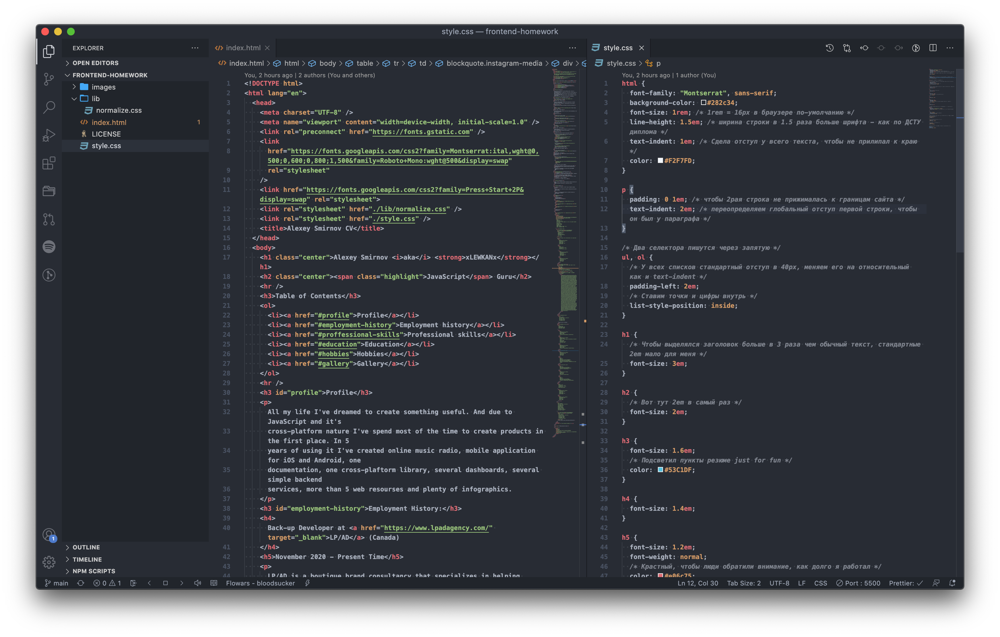
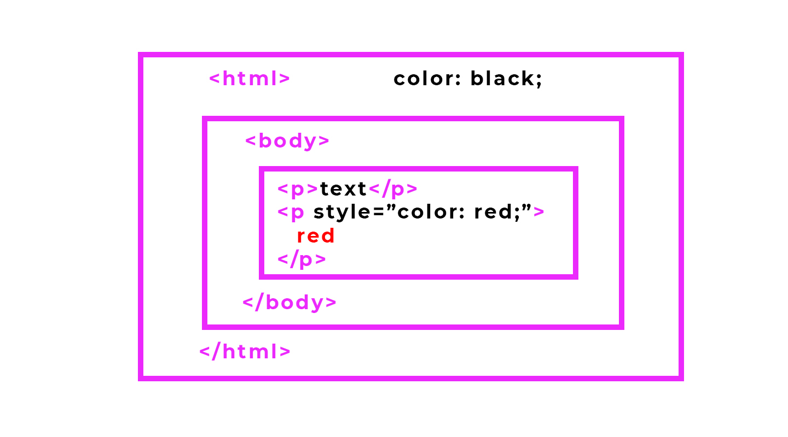

import background from "./images/background.jpg";
import styleAttribute from "./snippets/style-attribute.html";

<section
  data-background={background}
  data-background-size="cover"
  data-background-position="top left"
  data-background-opacity={0.1}>
<section>


# Знакомство с CSS

<CssLogo size="170" />

</section>
<section>


## В этом уроке:

- Как подключить CSS
- Как стилизовать элементы HTML
- Ваши первые CSS свойства
- Форматируем текст с помощью CSS
- Какие есть типы размеров CSS
- Работает с инструментами разработчика

</section>
<section>


## Литература

1. [Learn CSS with Mozilla](https://developer.mozilla.org/en-US/docs/Learn/CSS/First_steps)
2. [@import vs &lt;link&gt;](https://stackoverflow.com/questions/7199364/import-vs-link)
3. [CSS - Wikipedia](https://ru.wikipedia.org/wiki/CSS)
4. [CSS Colors](https://developer.mozilla.org/ru/docs/Web/CSS/color_value)
5. [CSS Значения и единицы](https://developer.mozilla.org/ru/docs/Learn/CSS/Building_blocks/Values_and_units)

</section>
</section>
<section>
<section>


## Что такое CSS

### (Cascading Style Sheets)

</section>
<section>


<p>
  <b>CSS</b> (
  <span class="IPA">
    <a
      href="/wiki/%D0%9C%D0%B5%D0%B6%D0%B4%D1%83%D0%BD%D0%B0%D1%80%D0%BE%D0%B4%D0%BD%D1%8B%D0%B9_%D1%84%D0%BE%D0%BD%D0%B5%D1%82%D0%B8%D1%87%D0%B5%D1%81%D0%BA%D0%B8%D0%B9_%D0%B0%D0%BB%D1%84%D0%B0%D0%B2%D0%B8%D1%82"
      title="Международный фонетический алфавит"
    >
      /siːɛsɛs/
    </a>
  </span>{" "}
  <a
    href="/wiki/%D0%90%D0%BD%D0%B3%D0%BB%D0%B8%D0%B9%D1%81%D0%BA%D0%B8%D0%B9_%D1%8F%D0%B7%D1%8B%D0%BA"
    title="Английский язык"
  >
    англ.
  </a>
  &nbsp;
  <span lang="en" style="font-style:italic;">
    Cascading Style Sheets
  </span>
  &nbsp;— <i>каскадные таблицы стилей</i>)&nbsp;— <a
    href="/wiki/%D0%A4%D0%BE%D1%80%D0%BC%D0%B0%D0%BB%D1%8C%D0%BD%D1%8B%D0%B9_%D1%8F%D0%B7%D1%8B%D0%BA"
    title="Формальный язык"
  >
    формальный язык
  </a> описания внешнего вида документа (<a
    href="/wiki/%D0%92%D0%B5%D0%B1-%D1%81%D1%82%D1%80%D0%B0%D0%BD%D0%B8%D1%86%D0%B0"
    title="Веб-страница"
  >
    веб-страницы
  </a>
  ), написанного с использованием{" "}
  <a
    href="/wiki/%D0%AF%D0%B7%D1%8B%D0%BA_%D1%80%D0%B0%D0%B7%D0%BC%D0%B5%D1%82%D0%BA%D0%B8"
    title="Язык разметки"
  >
    языка разметки
  </a>{" "}
  (чаще всего{" "}
  <a href="/wiki/HTML" title="HTML">
    HTML
  </a>{" "}
  или{" "}
  <a href="/wiki/XHTML" title="XHTML">
    XHTML
  </a>
  ). Также может применяться к любым <a href="/wiki/XML" title="XML">
    XML-документам
  </a>, например, к <a href="/wiki/SVG" title="SVG">
    SVG
  </a> или <a href="/wiki/XUL" title="XUL">
    XUL
  </a>.
</p>

</section>
<section>


<table>
  <thead>
    <tr>
      <th></th>
      <th>HTML</th>
      <th>CSS</th>
    </tr>
  </thead>
  <tbody>
    <tr>
      <th>
        Для кого:
      </th>
      <td>
        Для машин
      </td>
      <td>
        Для людей
      </td>
    </tr>
    <tr>
      <th>
        Задача:
      </th>
      <td>
        Структурирование
      </td>
      <td>
        Оформление
      </td>
    </tr>
    <tr>
      <th>
        Версия:
      </th>
      <td>
        HTML 5
      </td>
      <td>
        CSS 3
      </td>
    </tr>
    <tr>
      <th>
        Аналогии:
      </th>
      <td>
        <ul>
          <li>Каркас здания</li>
          <li>Скелет и мышцы</li>
        </ul>
      </td>
      <td>
        <ul>
          <li>Фасад и ремонт</li>
          <li>Внешность человека</li>
        </ul>
      </td>
    </tr>
  </tbody>
</table>
</section>
</section>
<section>
<section>


## Синтаксис CSS

</section>
<section data-auto-animate>


### Термины

```css data-id="css-1"
/* start of css rule */
selector {
  property: value;
}
/* end of css rule */
```

</section>
<section data-auto-animate>


### Реальный синтаксис

```css data-id="css-1"
p {
  color: yellow;
}
```

</section>
<section data-auto-animate>

### Несколько свойств (property)

```css data-id="css-1"
p {
  color: yellow;
  background-color: blue;
}
```

</section>
<section data-auto-animate>

### Несколько правил (css rules)

```css data-id="css-1"
p {
  color: yellow;
  background-color: blue;
}

h1 {
  font-size: 72px;
}
```

</section>
<section data-auto-animate>

### Two tags one rule

```css data-id="css-1"
p, h1 {
  color: red;
}
```

</section>
<section>


#### Вопрос 4.1

### Что случится, если мы введем не существующее CSS свойство?

<p className="fragment">А ничего!</p>

<p className="fragment">CSS игнорирует неизвестные свойства!</p>

</section>
</section>
<section>
<section>


## Подключение стилей

</section>
<section>

### Tag `<link />`

#### (External Stylesheets)

```html
<link rel="stylesheet" href="style.css" />
```

<EmmetLogo />: link:css

</section>
<section>


#### Задача 3.1

### Подключаем свои стили

Создаем новый файл (<VSCodeLogo />: <Hotkey mac={["ctrl", "N"]} />, <Hotkey mac={["ctrl", "S"]} />)
и называем его `style.css`.

Подключаем его в `index.html` с помощью тега линк (<EmmetLogo />: `link:css`)

</section>
<section>

#### Задача 3.2

### Подключаем сторонние стили

[Normalize.css](https://necolas.github.io/normalize.css/) — это CSS-файл от стороннего разработчика,
который делает так, чтобы все браузеры отображали HTML элементы одинаково.

Нужно его скачать и добавить его на свйо website с помощью тега `<link>`.

</section>
<section>


### Tag `<style />`

#### Internal Stylesheets

```
<head>
  <style type="text/css">
    p {
      color: yellow;
    }
  </style>
</head>
```

</section>
<section>


### Attribute `style`

#### (Inline Styles)

<RevealHtmlEditor source={styleAttribute} />

</section>
<section>


### Импорт через CSS

#### ([@import](https://developer.mozilla.org/en-US/docs/Web/CSS/@import) CSS Rule)

index.html:

```html
<link rel="stylesheet" href="style.css" />
```

main.css:

```css
@import "./paragraph.css";
```

paragraph.css

```css
p {
  color: yellow;
}
```

</section>
</section>
<section>
<section>


#### Лайфхак 4.1

### Split editing in VSCode

</section>
<section>


<VSCodeLogo />: <Hotkey mac={["ctrl", "/"]} />

<ImgContainer width="80%">




</ImgContainer>


</section>
</section>
<section>
<section>


## Базовые селекторы

</section>
<section>


### HTML Tag Selector

```css
p {
  font-size: 16px;
}

h1 {
  font-size: 28px;
}
```

Правило применяется ко всем тегам h1 и p на странице.

</section>
<section>

### HTML class attribute

```html
<ol>
  <li>Посмотреть урок</li>
  <li>Заплатить</li>
  <li class="most-important">Сделать домашку</li>
  <li class="most-important">Провести ревью</li>
</ol>
```

```css
.most-important {
  font-weight: bold;
}
```

Правило применяется ко всем тегам с атрибутом `class="most-important"`.

</section>
<section>


### HTML id attribute

```html
<h1>The Old Testament</h1>
<h2 id="genesis">Genesis</h2>
<h2 id="exodus">Exodus</h2>
```

```css
#genesis {
  text-shadow: yellow 5px 5px 3px;
}
```

Правило применяется ко всем тегам с атрибутом `class="most-important"`.

</section>
<section>


<iframe
  height="600px"
  style="width: 100%; height: 60vh"
  scrolling="no"
  title="[HTML-02] ID selector"
  src="https://codepen.io/xlwknx/embed/ExgjZNX?height=265&theme-id=light&default-tab=html,result"
  frameborder="no"
  loading="lazy"
  allowtransparency="true"
  allowfullscreen="true"
>
  See the Pen{" "}
  <a href="https://codepen.io/xlwknx/pen/ExgjZNX">[HTML-02] ID selector</a> by
  Alexey Smirnov (<a href="https://codepen.io/xlwknx">@xlwknx</a>) on{" "}
  <a href="https://codepen.io">CodePen</a>.
</iframe>

</section>
</section>
<section>
<section>

## Цвета в CSS

</section>
<section data-auto-animate>


### Варианты значений свойства color:

```css data-id="css-colors"
p {
  color: white;
  color: #000;
  color: #000000;
  color: rgb(0, 0, 0);
  color: rgba(0, 0, 0, 0);
  color: hsl(0, 0%, 0%);
  color: hsla(0, 0%, 0%);
}
```

</section>
<section data-auto-animate>


### То же самое для `background-color` и других свойст, принимающих цвет как значение:

```css data-id="css-colors"
p {
  background-color: white;
  background-color: #000;
  background-color: #000000;
  background-color: rgb(0, 0, 0);
  background-color: rgba(0, 0, 0, 0);
  background-color: hsl(0, 0%, 0%);
  background-color: hsla(0, 0%, 0%);
}
```

</section>
<section data-auto-animate>


### Реально используются:

```css data-id="css-colors"
p {
  background-color: #000000;
  background-color: rgba(0, 0, 0, 0);
}
```

</section>
<section data-auto-animate>


### Так же существуюет "прозрачный" цвет.

```css data-id="css-colors"
p {
  color: transparent;
}
```

[Список всех](https://developer.mozilla.org/ru/docs/Web/CSS/color_value) вариантов цветов и их
использование

</section>
<section>


### Полезные инструменты для работы с цветом:

1. [Встроенный](https://mspoweruser.com/visual-studio-code-now-really-useful-color-picker-built/#:~:text=Visual%20Studio%20Code%20now%20includes,picker%20to%20find%20a%20color.) Color Picker в VSCode.
2. [ColorPick Eyedropper](https://chrome.google.com/webstore/detail/colorpick-eyedropper/ohcpnigalekghcmgcdcenkpelffpdolg) для Chrome.

</section>
</section>
<section>
<section>

## Стилизация текста

</section>
<section>


### Свойства для шрифта, которые можно применить к любому селектору

```css
p {
  font-family: arial; /* Arial, sans-serif | Verdana, sans-serif | "Trebuchet MS", Verdana, sans-serif */
  font-size: 16px; /* 1em | 1rem  */
  font-weight: normal; /* bold | bolder | lighter | 100 - 900 */
  font-style: normal; /* italics | oblique */
  font-variant: normal; /* ни разу не использовал */
  font-stretch: normal; /* 50% или куча слов, которые обозначают эти проценты */
  line-height: 1.6;
}
```

</section>
<section>

### И если вы садист-извращенец, то можно впихнуть это в одну строку...

```css
p {
  font: italic normal bold normal 3em/1.5 Helvetica, Arial, sans-serif;
}
```

</section>
<section>


### Есть еще такие свойства:

```css
p {
  text-transform: none; /* uppercase | lowercase | capitalize | full-width */
  text-decoration: none; /* underline | overline | line-through */
  text-align: left; /* center | right | justify */
  letter-spacing: 4px;
  word-spacing: 4px;
  word-break: normal; /* break-all | keep-all */
  overflow-wrap: normal; /* break-word | anywhere */
}
```

...и еще [очень много](https://developer.mozilla.org/en-US/docs/Learn/CSS/Styling_text/Fundamentals#Other_properties_worth_looking_at) других

</section>
</section>
<section>
<section>

## Что значить "Каскадность" в CSS

</section>
<section>



</section>
<section data-auto-animate>

#### Свойство CSS #1
### Наследование

```css data-id="css-2"
html {
	color: black;
}

.class {
  color: red;
}
```

</section>
<section data-auto-animate>

### Наследование

```css data-id="css-2"
html {
	color: red;
}

p {
	color: blue;
}
```

</section>
</section>
<section>
<section>

## Размеры в CSS

</section>
<section>


### px - старые добрые пиксели

- Легко, удобно
- Дробятся (1.5px)

</section>
<section>


### % - старые, добрые проценты

- Легко, удобно
- Относительно размера родителя, [но не всегда](https://learn.javascript.ru/css-units#protsenty)
- Не для шрифтов

</section>
<section>


### em - старые, добрые проценты но для шрифтов

#### (ephemeral unit)

- Увеличился родительский шрифт, увеличилась и эта штука
- Для шрифтов

</section>
<section>


### rem - внебрачное детище px и em

- Относительные, как и em
- Не понятные, не удобные
- "Хипстерские" в плохом смысле этого слова
- Относительны "базовому" шрифту браузера

</section>
</section>
<section>
<section>


## Стили для базовых тегов

</section>
<section>


### Стилизация списков `<ul>` и `<ol>`

```css
ul {
  list-style: none;
  margin: 0;
  padding: 0;
  column-count: 2;
}
```

</section>
</section>
<section>
<section>


### Домашнее задание 3

## Красиво оформленное резюме

</section>
<section>


### Выбираем любимый цвев и генерируем схему

Выбираем любимый цвет и на основе этого цвета генерируем палитру.
Сервисы в помощь:

- [Сoolors](https://coolors.co/) - the super fast color schemes generator!
- [Adobe Color Wheel](https://color.adobe.com/create/color-wheel)
- [Colormind](http://colormind.io/) - AI color generator

</section>
<section>


### Выбираем любимые шрифты и полключаем через `<link>`

Заходим на [fonts.google.com](https://fonts.google.com/) и выбираем шрифты, которые будем использовать.

Для главного шрифта необходимый минимум:

- regular (400)
- medium (500)
- bold (700)
- курсивы, если используются

</section>
<section>


### Начинаем творить:

1. Поключить `normalize.css`
2. Добавить оглавение с якорями
3. Поменять цвет фона
4. Поменять цвет основного шрифта
5. Выстроить размеры заголовков
6. Использовать минимум 1 класс
7. Использовать минимум 1 id

</section>
</section>