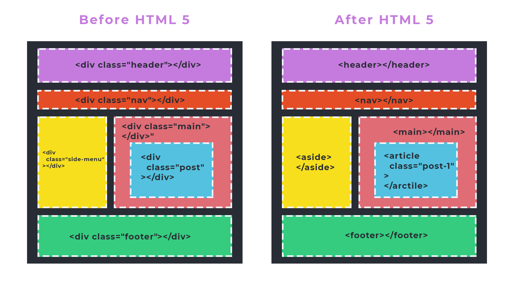
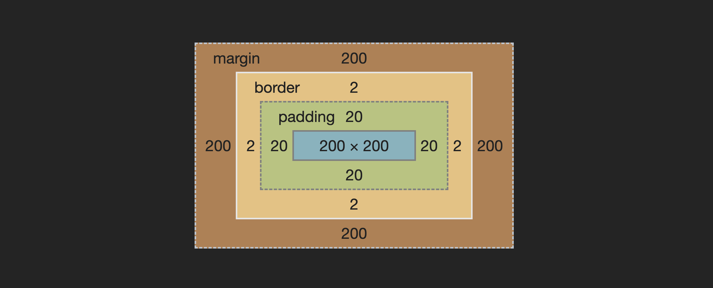

import background from "./images/background.jpg";
import flexBoxWebp from "./images/flexbox.webp";
import marginPaddingPng from "./images/margin-padding.png";
import windowsXpPng from "./images/window-xp-background.png";

const STAGE = "html";
const LESSON = "html-04";

<section
  data-background={background}
  data-background-size="cover"
  data-background-position="top left"
  data-background-opacity={0.1}
>
<section>

# Контейнеры в сетке

</section>
<section>

## А так же

</section>
<section>

## Источники

1. [[YouTube] CSS Grid Changes EVERYTHING](https://www.youtube.com/watch?v=7kVeCqQCxlk)
2. [[Habr] CSS Grid Layout. Быстрый старт](https://habr.com/ru/post/325760/)
3. [[CSS Tricks]](https://css-tricks.com/look-ma-no-media-queries-responsive-layouts-using-css-grid/)
4. [[CSS Trick]](https://css-tricks.com/box-sizing/)

</section>
<section>

1. [Конструктор Grid](https://grid.layoutit.com/)

</section>
</section>
<section>
<section>

## Контейнеры в HTML

<ImgContainer width="90%">



</ImgContainer>

</section>
<section>

## Типы контейнеров

- Классический пустой контейнер `<div>`
- Семантический контейнер со смыслом (см. [список](https://www.w3schools.com/html/html5_semantic_elements.asp))

</section>
<section>

### Свойства контейнеров

1. По умолчанию имеют CSS свойство `display: block`;
2. Могут иметь атрибуты `id` и `class`;
3. Занимают всю ширину родителя по умолчанию (т, е: `width: auto`);
4. Увиличиваются в зависимости от контента (т.е: `height: auto`)
5. Начинаются под предыдущим элементом

</section>
</section>

<section>
<section>

## Блоковая модель

#### Box model

</section>

<section>

### Box model

<div class="r-stack">

```css
.box {
  width: 200px;
  height: 200px;
  margin: 200px;
  padding: 20px;
  border: 2px solid black;
}
```

<ImgContainer width="100%" class="fragment">



</ImgContainer>

</div>

</section>
<section>

### Облегчаем себе жизнь

```css
html {
  box-sizing: border-box;
}

*,
*:before,
*:after {
  box-sizing: inherit;
}
```

</section>
<section>

### Что это?

<div class="r-stack">

До появления свойства `box-sizing: border-box` ширина любого контейнера не учитывала отступы и рамки.
Ты пишешь такой `width: 100%` и думаешь что твой блок будет занимать 100% от ширины родителя, а он:

<ImgContainer width="80%" className="fragment">


</ImgContainer>
</div>
</section>
<section>

<CodeSandbox
  lesson={LESSON}
  files={["style.css", "index.html"]}
  example="box-sizing"
  stage={STAGE}
/>

</section>

</section>
<section>
<section>

## Внешние и внутренние отступы

#### margin and padding

</section>
<section data-background={marginPaddingPng}>

</section>
<section data-auto-animate>

#### 1. Короткая и длинные записи

```css data-id="margin-1"
.box {
  margin: 12px 3px 6px 9px;
  /* same as: */
  margin-top: 12px;
  margin-right: 3px;
  margin-bottom: 6px;
  margin-left: 9px;
}
```

</section>
<section data-auto-animate>

#### 2. Тройная запись

```css data-id="margin-1"
.box {
  margin: 12px 3px 9px;
  /* same as: */
  margin-top: 12px;
  margin-left: 3px;
  margin-right: 3px;
  margin-bottom: 9px;
}
```

</section>
<section data-auto-animate>

#### 3. Двойная запись

```css data-id="margin-1"
.box {
  margin: 12px 3px;
  /* same as: */
  margin-top: 12px;
  margin-bottom: 12px;
  margin-left: 3px;
  margin-right: 3px;
}
```

</section>
<section data-auto-animate>

#### 4. "На все четыре стороны"

```css data-id="margin-1"
.box {
  margin: 12px;
  /* same as: */
  margin-top: 12px;
  margin-bottom: 12px;
  margin-left: 12px;
  margin-right: 12px;
}
```

</section>
<section data-auto-animate>

### "Особенности" margin

- Может иметь значение `auto`.
- ["Схлопывание" (collapse) отступов](https://dev.to/camfilho/margin-collapse-explained-by-images-361e).

</section>
</section>
<section>
<section>

## Ширина и высота блока

#### width and height

</section>
<section>

### Основные значения width and height

- Стандартное (`auto`)
- Фиксированные (`px`, `em`, `rem`)
- Относительные
  - Родителя (`%`)
  - Экрана (`vw`, `vh`)
- [И другие](https://developer.mozilla.org/ru/docs/Learn/CSS/Building_blocks/Values_and_units#%D0%A7%D0%B8%D1%81%D0%BB%D0%B0_%D0%B4%D0%BB%D0%B8%D0%BD%D1%8B_%D0%B8_%D0%BF%D1%80%D0%BE%D1%86%D0%B5%D0%BD%D1%82%D1%8B)

</section>
<section>

### Фиксированная ширина и высота

<CodeSandbox
  lesson={LESSON}
  files={["style.css", "index.html"]}
  example="css-awesome"
  stage={STAGE}
/>

</section>
</section>
<section>

#### 4.1 Pattern

## "Responsive container"

<CodeSandbox
  lesson={LESSON}
  height={500}
  files={["style.css", "index.html"]}
  example="container-pattern"
  stage={STAGE}
/>

</section>
<section>
<section>

### Границы и обводки

#### `border` and `outline`

</section>
<section>

### border

```css
.rectangle {
  border: 1px solid black;
  /* same as: */
  border-width: 1px;
  border-style: solid;
  border-color: black;
}
```

</section>
</section>
<section>
<section>

## Фоны

</section>
<section
  data-auto-animate
  data-background={windowsXpPng}
  data-background-size="auto auto"
  data-background-position="0% 0%"
  data-background-repeat="repeat"
  data-background-transition="slide"
>

```css data-id="background-1"
.box {
  background-image: url(./images/безмятежность.png);
}
```

</section>
<section
  data-auto-animate
  data-background={windowsXpPng}
  data-background-size="auto auto"
  data-background-position="0% 0%"
  data-background-repeat="repeat"
  data-background-transition="slide"
>

```css data-id="background-1"
.box {
  background-image: url(./images/безмятежность.png);
}
```

</section>
<section
  data-auto-animate
  data-background={windowsXpPng}
  data-background-size="auto auto"
  data-background-position="0% 0%"
  data-background-repeat="no-repeat"
  data-background-color="green"
  data-background-transition="slide"
>

```css data-id="background-1"
.box {
  background-image: url(./images/безмятежность.png);
  background-repeat: no-repeat;
  background-color: green;
}
```

</section>
<section
  data-auto-animate
  data-background={windowsXpPng}
  data-background-size="auto auto"
  data-background-position="center"
  data-background-repeat="no-repeat"
  data-background-transition="slide"
>

```css data-id="background-1"
.box {
  background-image: url(./images/безмятежность.png);
  background-repeat: no-repeat;
  background-position: center;
}
```

</section>
<section
  data-auto-animate
  data-background={windowsXpPng}
  data-background-size="auto auto"
  data-background-position="center top"
  data-background-repeat="no-repeat"
  data-background-transition="slide"
>

```css data-id="background-1"
.box {
  background-image: url(./images/безмятежность.png);
  background-repeat: no-repeat;
  background-position: center top;
}
```

</section>
<section
  data-auto-animate
  data-background={windowsXpPng}
  data-background-size="auto auto"
  data-background-position="right 35% bottom 45%"
  data-background-repeat="no-repeat"
  data-background-transition="slide"
>

```css data-id="background-1"
.box {
  background-image: url(./images/безмятежность.png);
  background-repeat: no-repeat;
  background-position: right 35% bottom 45%;
}
```

</section>
<section
  data-auto-animate
  data-background={windowsXpPng}
  data-background-size="contain"
  data-background-repeat="no-repeat"
  data-background-transition="slide"
>

```css data-id="background-1"
.box {
  background-image: url(./images/безмятежность.png);
  background-repeat: no-repeat;
  background-size: contain;
}
```

</section>
<section
  data-auto-animate
  data-background={windowsXpPng}
  data-background-size="contain"
  data-background-repeat="repeat"
  data-background-transition="slide"
>

```css data-id="background-1"
.box {
  background-image: url(./images/безмятежность.png);
  background-repeat: repeat;
  background-size: contain;
}
```

</section>
<section
  data-auto-animate
  data-background={windowsXpPng}
  data-background-size="cover"
  data-background-repeat="no-repeat"
  data-background-transition="slide"
>

```css data-id="background-1"
.box {
  background-image: url(./images/безмятежность.png);
  background-repeat: no-repeat;
  background-size: cover;
}
```

</section>
</section>
<section>
<section data-background-image={flexBoxWebp}>

## Flexbox

</section>
</section>
