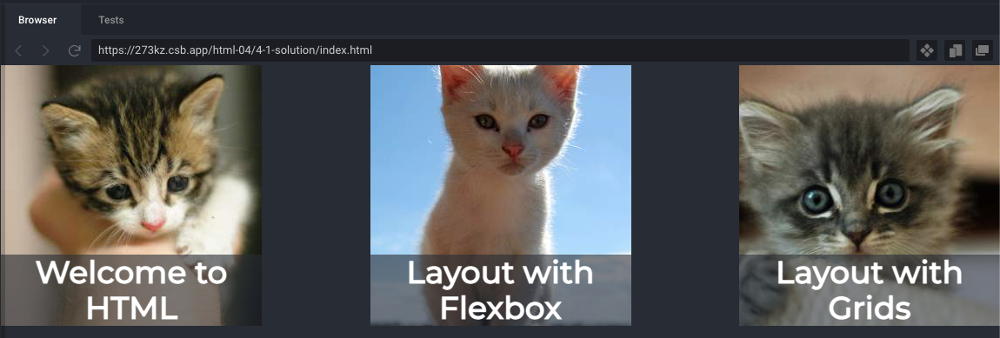
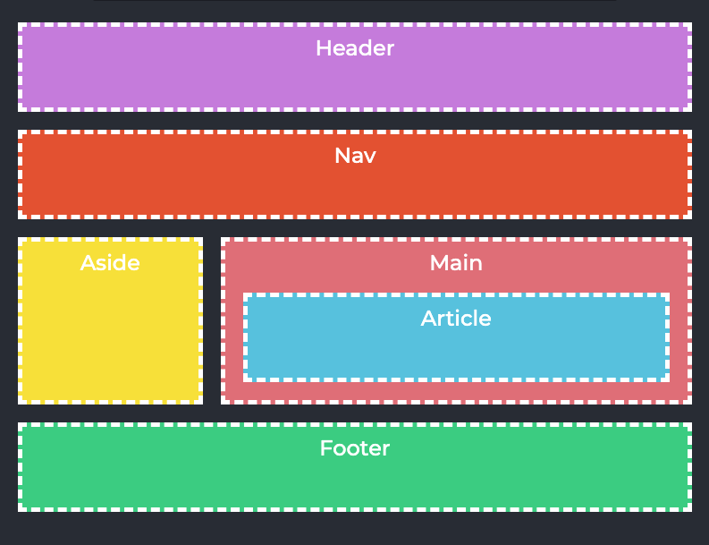

import background from "./images/background.jpg";
import flexBoxWebp from "./images/flexbox.webp";
import marginPaddingPng from "./images/margin-padding.png";
import windowsXpPng from "./images/window-xp-background.png";
import gridJpg from "./images/grid.jpeg";

export const STAGE = "html";
export const LESSON = "html-04";

<section
  data-background={background}
  data-background-size="cover"
  data-background-position="top left"
  data-background-opacity={0.1}
>
<section>

# Контейнеры в сетке

</section>
<section>

## А так же

</section>
<section>

## Источники

1. [[CSS Tricks] Box sizing](https://css-tricks.com/box-sizing/)
2. [[Learn JS] Все значения свойства display](https://learn.javascript.ru/display)
3. [[CSS Tricks] A Complete Guide to Flexbox](https://css-tricks.com/snippets/css/a-guide-to-flexbox/)
4. [[CSS Tricks] A Complete Guide to Grid](https://css-tricks.com/snippets/css/complete-guide-grid/)
5. [[YouTube] CSS Grid Changes EVERYTHING](https://www.youtube.com/watch?v=7kVeCqQCxlk)
6. [[Habr] CSS Grid Layout. Быстрый старт](https://habr.com/ru/post/325760/)
7. [[CSS Tricks] CSS Grids without media queries](https://css-tricks.com/look-ma-no-media-queries-responsive-layouts-using-css-grid/)

</section>
<section>

1. [Конструктор Grid](https://grid.layoutit.com/)

</section>
</section>
<section>
<section>

## Контейнеры в HTML

<ImgContainer width="90%">


</ImgContainer>

</section>
<section>

## HTML теги контейнеров

- Классический пустой контейнер `<div>`
- Семантический контейнер со смыслом (см. [список](https://www.w3schools.com/html/html5_semantic_elements.asp))

</section>
<section>

### Свойства контейнеров

1. По умолчанию имеют CSS свойство `display: block`;
2. Могут иметь атрибуты `id` и `class`;
3. Занимают всю ширину родителя по умолчанию (т, е: `width: auto`);
4. Увиличиваются в зависимости от контента (т.е: `height: auto`)
5. Начинаются под предыдущим элементом

</section>
</section>

<section>
<section>

## Блоковая модель

#### Box model

</section>

<section>

### Box model

<div class="r-stack">

```css
.box {
  width: 200px;
  height: 200px;
  margin: 200px;
  padding: 20px;
  border: 2px solid black;
}
```

<ImgContainer width="100%" class="fragment">


</ImgContainer>

</div>

</section>
<section>

### Облегчаем себе жизнь

```css
html {
  box-sizing: border-box;
}

*,
*:before,
*:after {
  box-sizing: inherit;
}
```

</section>
<section>

### Что это?

<div class="r-stack">

До появления свойства `box-sizing: border-box` ширина любого контейнера не учитывала отступы и рамки.
Ты пишешь такой `width: 100%` и думаешь что твой блок будет занимать 100% от ширины родителя, а он:

<ImgContainer width="80%" className="fragment">


</ImgContainer>
</div>
</section>
<section>

<CodeSandbox
  lesson={LESSON}
  files={["style.css", "index.html"]}
  example="box-sizing"
  stage={STAGE}
/>

</section>

</section>
<section>
<section>

## Внешние и внутренние отступы

#### margin and padding

</section>
<section data-background={marginPaddingPng}>

</section>
<section data-auto-animate>

#### 1. Короткая и длинные записи

```css data-id="margin-1"
.box {
  margin: 12px 3px 6px 9px;
  /* same as: */
  margin-top: 12px;
  margin-right: 3px;
  margin-bottom: 6px;
  margin-left: 9px;
}
```

</section>
<section data-auto-animate>

#### 2. Тройная запись

```css data-id="margin-1"
.box {
  margin: 12px 3px 9px;
  /* same as: */
  margin-top: 12px;
  margin-left: 3px;
  margin-right: 3px;
  margin-bottom: 9px;
}
```

</section>
<section data-auto-animate>

#### 3. Двойная запись

```css data-id="margin-1"
.box {
  margin: 12px 3px;
  /* same as: */
  margin-top: 12px;
  margin-bottom: 12px;
  margin-left: 3px;
  margin-right: 3px;
}
```

</section>
<section data-auto-animate>

#### 4. "На все четыре стороны"

```css data-id="margin-1"
.box {
  margin: 12px;
  /* same as: */
  margin-top: 12px;
  margin-bottom: 12px;
  margin-left: 12px;
  margin-right: 12px;
}
```

</section>
<section data-auto-animate>

### "Особенности" margin

- Может иметь значение `auto`.
- ["Схлопывание" (collapse) отступов](https://dev.to/camfilho/margin-collapse-explained-by-images-361e).
- Вертикальный отступ в % считается от ширины (sic!)

</section>
</section>
<section>
<section>

## Ширина и высота блока

#### width and height

</section>
<section>

### Основные значения width and height

- Стандартное (`auto`)
- Фиксированные (`px`, `em`, `rem`)
- Относительные
  - Родителя (`%`)
  - Экрана (`vw`, `vh`)
- [И другие](https://developer.mozilla.org/ru/docs/Learn/CSS/Building_blocks/Values_and_units#%D0%A7%D0%B8%D1%81%D0%BB%D0%B0_%D0%B4%D0%BB%D0%B8%D0%BD%D1%8B_%D0%B8_%D0%BF%D1%80%D0%BE%D1%86%D0%B5%D0%BD%D1%82%D1%8B)

</section>
<section>

### Фиксированная ширина и высота

<CodeSandbox
  lesson={LESSON}
  files={["style.css", "index.html"]}
  example="css-awesome"
  stage={STAGE}
/>

</section>
<section>

#### CSS property
### Функции в CSS

```css
.box {
  margin: 20px;
  width: calc(100% - 40px);
  height: calc(100vh - 40px);
}

```

</section>
<section>

#### 4.1 Pattern

## "Responsive container"

<CodeSandbox
  lesson={LESSON}
  height={500}
  files={["style.css", "index.html"]}
  example="container-pattern"
  stage={STAGE}
/>

</section>
</section>
<section>
<section>

#### CSS Property
## `display`

</section>
<section>

### `display: block;`

- Стандартное значение всех блочных элементов
- Блок стремится расшириться на всю доступную ширину
- Блочные элементы располагаются один над другим, вертикально (если нет особых свойств позиционирования, например float).

</section>
<section>


#### CSS Property
### `float`

- Раньше использовался для верстки всего сайта, сейчас по прямому назначению - для обтекания текста
- Блок выпадает из потока ([см. clearfix](https://www.w3schools.com/howto/howto_css_clearfix.asp))
- Игнорирует `display` и превращает элемент в `block`

</section>
<section>

<CodeSandbox
  lesson={LESSON}
  height={600}
  files={["style.css", "index.html"]}
  example="float"
  stage={STAGE}
/>

</section>
<section>

### `display: inline`

- Стандартное свойство для всех строчных элементов
- Элементы располагаются на той же строке, последовательно.
- Ширина и высота элемента определяются по содержимому. Поменять их нельзя.

</section>
<section>

### `display: inline-block;`

- Как и инлайн-элемент:
  - Располагается в строке.
  - Размер устанавливается по содержимому.
  - Наследует свойство `vertical-align`, о котором хорошо написано [здесь](https://htmlacademy.ru/blog/boost/frontend/the-vertical-align-property)
- Во всём остальном – это блок, то есть:
  - Элемент всегда прямоугольный.
  - Работают свойства `width`/`height`.

</section>
<section>

### Применение `display: inline-block;`

- Встраивание блочных елементов в текст
- [До flexbox] Расположение блочных елементов в ряд (например иконок)
- [До flexbox] Вертикальное выравнивание по центру

</section>
<section>

### `display: table;`, `display: table-cell;`, `display: table-row`; 

```css
table    { display: table; }
tr       { display: table-row; }
thead    { display: table-header-group; }
tbody    { display: table-row-group; }
tfoot    { display: table-footer-group; }
col      { display: table-column; }
colgroup { display: table-column-group; }
td, th   { display: table-cell; }
caption  { display: table-caption; }
```

</section>
<section>

### `display: none;` 

- Нужно **удалить** тег со страницы
- Используется с помощью JS  

</section>
</section>
<section>
<section data-background-image={flexBoxWebp}>

## Flexbox
### `display: flex;`

</section>
<section>

#### Flex container basic properties:

```css
.container {
  display: flex;
  flex-direction: row; /* row | row-reverse | column |
    column-reverse;  */
  justify-content: flex-start; /* | flex-end | center |
    space-between | space-around | space-evenly |
    start | end | left | right ... + safe | unsafe */
  align-items: stretch /* flex-start | flex-end |
    center | baseline | first baseline | last baseline |
    start | end | self-start | self-end + ... safe | unsafe */;
}
```
#### Flex child basic properties:

```css
.child {
  flex-grow: 0; /* 1, ..., n */
  flex-shrink: 1; /* 2, ..., n */
  flex-basis: auto; /* 0, 200px, 50% */
}
```

</section>
<section>

<CodeSandbox
  lesson={LESSON}
  height={600}
  files={["style.css", "index.html"]}
  example="flexbox"
  stage={STAGE}
/>

</section>
<section>

<CodeSandbox
  lesson={LESSON}
  height={600}
  files={["style.css", "index.html"]}
  example="flexbox-layout"
  stage={STAGE}
/>

</section>
<section>

#### Задача 4.1
## Блог-посты

1. Расположить блог-посты в один ряд с помощью свойства `display: flex`;
2. Расположить `.post-title` внизу;
3. Запретить картинкам уменьшаться с помощью свойства `flex-shrink`;
4. Расположить посты по центру с увеличивающимся отступом с помощью свойства `justify-content`;

</section>
<section>



</section>
<section>

<CodeSandbox
  lesson={LESSON}
  height={600}
  files={["style.css", "index.html"]}
  example="4-1-flexbox-blog-posts"
  stage={STAGE}
/>

</section>
<section>

#### Задача 4.2
## Сетка на flexbox

1. Обернуть `<aside>` и `<main>` во flexbox контейнер;
2. Сделать так, чтобы `<aside>` и `<main>` занимали 1/4 и 3/4 от всей длинны контейнера
3. Выравнять отступы между элементаментами до 20 пикселей

</section>
<section>



</section>
<section>

<CodeSandbox
  lesson={LESSON}
  height={600}
  files={["style.css", "index.html"]}
  example="4-2-flexbox-layout"
  stage={STAGE}
/>

</section>
</section>
<section>
<section data-background={gridJpg}>

## CSS Grids
### `display: grid;`

</section>
<section>

### Типы Grid

</section>
<section>

### Явные
#### Explicit

- Количество компонентов определенно
- Новые компоненты не появляются автоматически
- Родительские свойства `grid-template-column`, `grid-template-rows`, `grid-areas`
- Дочерние свойства `grid-area`, `grid-column`, `grid-row`

</section>
<section>

#### Алгоритм расположения явных сеток

1. Делим контейнеры верхнего уровня на секции
2. Задаем кол-во столбцов `grid-template-column` для родителя
3. Задаем кол-во рядов `grid-template-rows` для родилетя
4. Пишем схему сетки в свойство `grid-areas` для родителя
5. Определяем свойство `grid-area` для дочерних контейнеров


</section>
<section>

### Невные
#### Implicit

- Количество компонентов не определенно
- Новые компоненты могут появляються автоматически
- Свойства `grid-auto-column`, `grid-auto-rows`, `grid-auto-flow`

</section>
<section>

<CodeSandbox
  lesson={LESSON}
  height={600}
  files={["style.css", "index.html"]}
  example="grid"
  stage={STAGE}
/>

</section>
<section>

<CodeSandbox
  lesson={LESSON}
  height={600}
  files={["style.css", "index.html"]}
  example="grid-layout"
  stage={STAGE}
/>

</section>
</section>
<section>
<section>

#### CSS Property
## background

```css
.container {
  background-image: url(/path/to/file.png);
  background-size: cover;
  background-repeat: repeat;
  background-position: center;
}
```

</section>
<section
  data-auto-animate
  data-background={windowsXpPng}
  data-background-size="auto auto"
  data-background-position="0% 0%"
  data-background-repeat="repeat"
  data-background-transition="slide"
>

```css data-id="background-1"
.box {
  background-image: url(./images/безмятежность.png);
}
```

</section>
<section
  data-auto-animate
  data-background={windowsXpPng}
  data-background-size="auto auto"
  data-background-position="0% 0%"
  data-background-repeat="repeat"
  data-background-transition="slide"
>

```css data-id="background-1"
.box {
  background-image: url(./images/безмятежность.png);
}
```

</section>
<section
  data-auto-animate
  data-background={windowsXpPng}
  data-background-size="auto auto"
  data-background-position="0% 0%"
  data-background-repeat="no-repeat"
  data-background-color="green"
  data-background-transition="slide"
>

```css data-id="background-1"
.box {
  background-image: url(./images/безмятежность.png);
  background-repeat: no-repeat;
  background-color: green;
}
```

</section>
<section
  data-auto-animate
  data-background={windowsXpPng}
  data-background-size="auto auto"
  data-background-position="center"
  data-background-repeat="no-repeat"
  data-background-transition="slide"
>

```css data-id="background-1"
.box {
  background-image: url(./images/безмятежность.png);
  background-repeat: no-repeat;
  background-position: center;
}
```

</section>
<section
  data-auto-animate
  data-background={windowsXpPng}
  data-background-size="auto auto"
  data-background-position="center top"
  data-background-repeat="no-repeat"
  data-background-transition="slide"
>

```css data-id="background-1"
.box {
  background-image: url(./images/безмятежность.png);
  background-repeat: no-repeat;
  background-position: center top;
}
```

</section>
<section
  data-auto-animate
  data-background={windowsXpPng}
  data-background-size="auto auto"
  data-background-position="right 35% bottom 45%"
  data-background-repeat="no-repeat"
  data-background-transition="slide"
>

```css data-id="background-1"
.box {
  background-image: url(./images/безмятежность.png);
  background-repeat: no-repeat;
  background-position: right 35% bottom 45%;
}
```

</section>
<section
  data-auto-animate
  data-background={windowsXpPng}
  data-background-size="contain"
  data-background-repeat="no-repeat"
  data-background-transition="slide"
>

```css data-id="background-1"
.box {
  background-image: url(./images/безмятежность.png);
  background-repeat: no-repeat;
  background-size: contain;
}
```

</section>
<section
  data-auto-animate
  data-background={windowsXpPng}
  data-background-size="contain"
  data-background-repeat="repeat"
  data-background-transition="slide"
>

```css data-id="background-1"
.box {
  background-image: url(./images/безмятежность.png);
  background-repeat: repeat;
  background-size: contain;
}
```

</section>
<section
  data-auto-animate
  data-background={windowsXpPng}
  data-background-size="cover"
  data-background-repeat="no-repeat"
  data-background-transition="slide"
>

```css data-id="background-1"
.box {
  background-image: url(./images/безмятежность.png);
  background-repeat: no-repeat;
  background-size: cover;
}
```

</section>
</section>
<section>
<section>

#### Домашнее задание 4
## Сетка сайта

</section>
<section>

* Перенести CV в папку (например `"pages/cv/"`)
* Создать новый file `index.html` и `style.css` для главной страницы
* Сделать сетку сайта
* Минимум 1 блок с `display: grid`
* Минимум 1 блок с `display: flexbox`
* Минимум 1 блок должен быть с `background-image`

</section>
<section>

### Где искать примеры:

- https://www.free-css.com/
- https://themeforest.net/
- https://nicepage.com/css-templates
- https://templatemo.com/

</section>
<section>

### По ключевым словам:

- portfolio template
- free css layouts
- css templates
- wordpress html templates
- bootrap templates
- responsive html templates

</section>
<section>

### Мои референсы:

- [http://rhythm.bestlooker.pro/mp-index-08.html](http://rhythm.bestlooker.pro/mp-index-08.html)
- [https://preview.themeforest.net/item/martin-luther-personal-portfolio-template/full_screen_preview/20826058](https://preview.themeforest.net/item/martin-luther-personal-portfolio-template/full_screen_preview/20826058)

</section>
</section>
