import background from "./images/background.jpg";
import Hotkey from "components/Hotkey";
import browsers from "./images/browsers.png";
import rip from "./images/rip.png";
import liveReloadUrl from "./images/live-reload.png";
import markupDefinition from "./snippets/markup-definition.html";
import htmlStructure from "./snippets/structure.html";
import { pickLine } from "components/lessons/reveal/utils";
import spaces from "./snippets/spaces.html";
import ul from "./snippets/ul.html";
import ol from "./snippets/ol.html";
import linkHtml from "./snippets/link.html";
import listExampleHtml from "./snippets/list-example.html";
import githubGif from "./images/github-3.gif";
import theEnd from "../html-06/images/the-end.png";

<section
  data-background={background}
  data-background-size="cover"
  data-background-position="top left"
  data-background-opacity={0.1}
>
<section>

## Lesson 1.

# Heroic introduction in

<HtmlLogo height="30vh" />

</section>
<section>

## And also:

- History of HTML and its significance
- Key concepts
- Editing HTML
- Publishing our first HTML page on the internet
- Learning the first HTML tags

</section>
</section>
<section>
<section>

### Part 0.

## Preparing for the Lesson

</section>
<section>

### Software

We will need two programs for our work:

1. [Visual Studio Code ©](https://code.visualstudio.com/) - we will write code here.
2. [Google Chrome ©](https://www.google.com/chrome/) - we will view the results here.

</section>
<section>

<div className="r-stack">

<div data-fragment-index={1} class="fragment fade-out">

Both programs support plugins from third-party developers.

To avoid manually refreshing the page, we will use the LiveReload © plugin for
[Visual Studio Code ©](https://marketplace.visualstudio.com/items?itemName=ziishaned.livereload) and
[Google Chrome ©](https://chrome.google.com/webstore/detail/livereload/jnihajbhpnppcggbcgedagnkighmdlei?hl=ru).

To get started, simply install them.

</div>

<div data-fragment-index={1} class="fragment fade-in-then-out" style={{ width: "100%" }}>

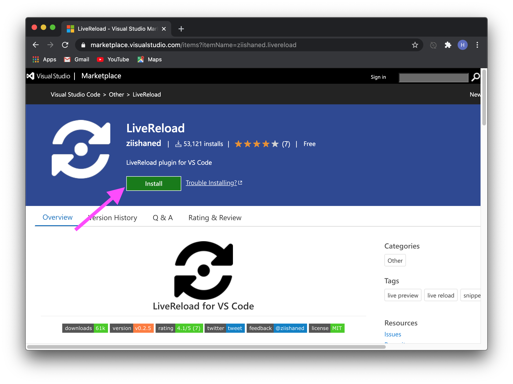

</div>

<div class="fragment fade-in-then-out" style={{ width: "100%" }}>

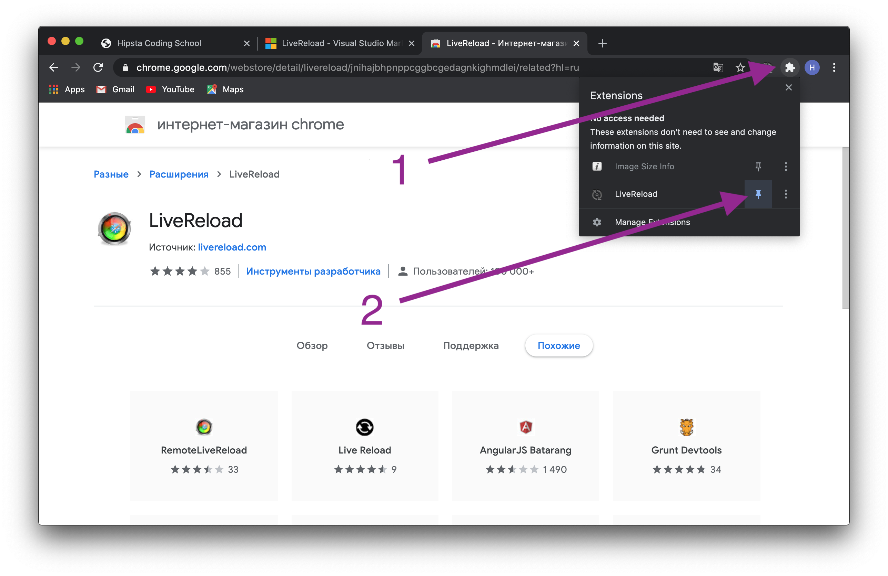

</div>

<div class="fragment fade-in-then-out" style={{ width: "100%" }}>

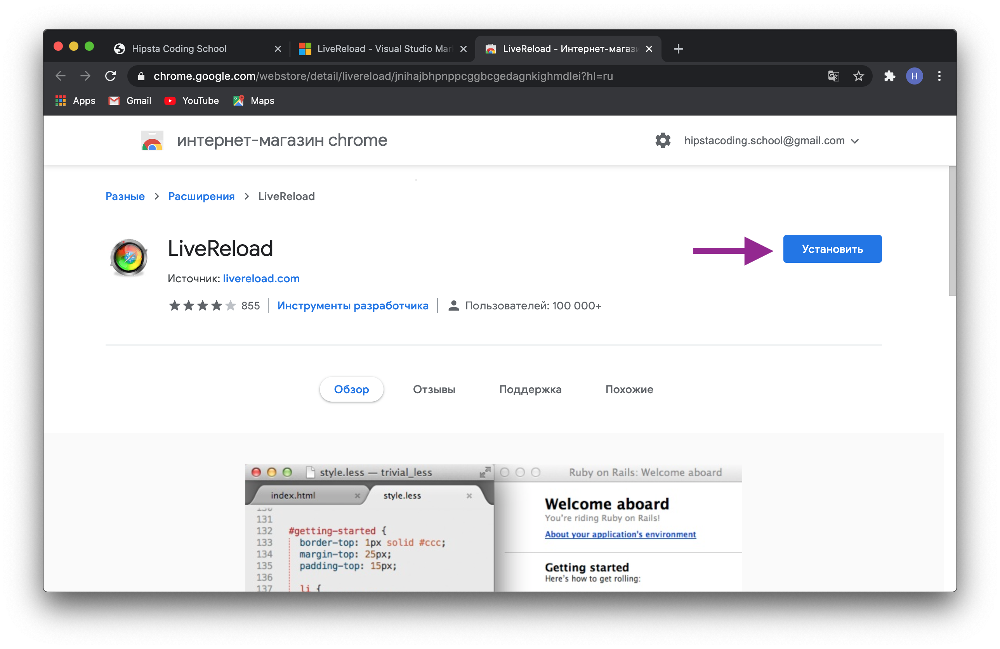

</div>

<div class="fragment fade-in-then-out" style={{ width: "100%" }}>


</div>

</div>

</section>
<section>

### GitHub

I call it a social network for programmers, where instead of photos and posts, your code is showcased. To get started, simply [register](https://github.com/) and, if you wish, add [me](https://github.com/xLEWKANx) as a friend and give a like (star) to the [hipstacoding website](https://github.com/HipstaCoding/hipstacoding.github.io).

</section>
</section>
<section>
<section>

### Part 1.

## History of HTML

</section>
<section>

<div className="r-stack">

<span>

### 1990

<span className="fragment fade-in">

- British scientist Tim Berners-Lee invented the world's first browser called **World Wide Web** (abbreviated as **WWW**) at CERN in Geneva.

</span>

</span>

<span className="fragment" style={{ width: "80%" }}>

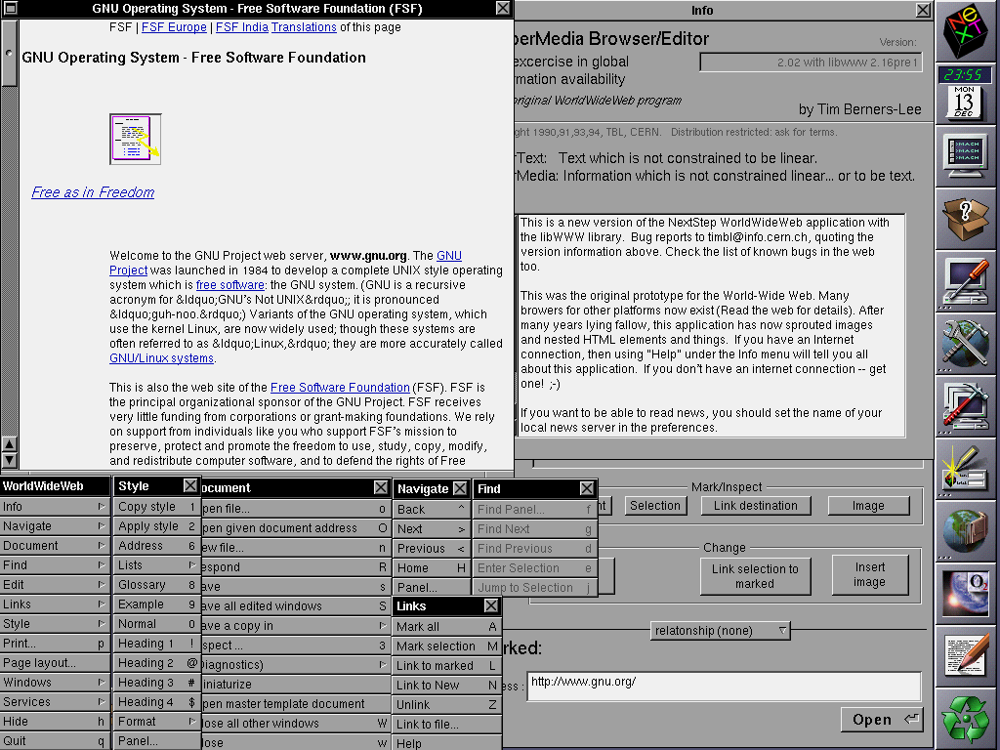

</span>

</div>
</section>
<section>

### 1991 

<ul>
  <li className="fragment">
    The same guy invents the HyperText Markup Language, also known as HTML, designed for structuring and formatting documents on the World Wide Web.
  </li>
  <li className="fragment">
    This year marks the appearance of the world's first <a href="http://info.cern.ch/hypertext/WWW/TheProject.html">website</a>
  </li>
</ul>

</section>
<section>

### First Browser War

#### 1995-1999

Netscape vs Internet Explorer

</section>
<section>

<div className="r-stack">

- **1995** In Netscape, employee Brandan Eich created JavaScript in 10 days and initially named it Mocha.
- **1996** Microsoft implemented the CSS (Cascading Style Sheets) language into Internet Explorer.
- **1997** Microsoft added Internet Explorer to Windows.
- **1999** Internet Explorer displaced Netscape from the market.

<span className="fragment" style={{ width: "40%" }}>


</span>

</div>

</section>
<section>

### Second Browser War or "Browser Zoo"

#### 2005-2015

Internet Explorer vs:

- Netscape, which became Mozilla Firefox
- Apple Safari
- Opera Mini
- Google Chrome

</section>
</section>
<section>
<section>

### Why is HTML needed and who needs it?

</section>
<section>

#### Front-End Developers

Front-End developers need to have a thorough understanding of HTML and CSS. The Front-End development process looks like this:

- Building the document structure using HTML.
- Adding styling using CSS.
- Writing JavaScript code for interactive components.

</section>
<section>

#### All Other Developers

HTML is still the best and sometimes the only way to create a user interface.

</section>
<section>

#### UI/UX Designers

Any good UI/UX designer should know how HTML and CSS work in order to create proper interfaces. Additionally, a designer who can code will be more valued in the job market.

</section>
<section>

#### SEO Specialists

For client-side search engine optimization, it is necessary to modify HTML tags, albeit sometimes indirectly.

</section>
<section>

#### Marketers

Marketers usually do not know HTML, but they deal with emails written in HTML on a daily basis, as well as services that are embedded into websites through HTML (e.g., Google Analytics). Therefore, they constantly rely on developers to assist them. By having knowledge of how HTML works, they can do it themselves and thereby increase their market value.

</section>
<section>

<div className="r-stack">

#### Where Can You See HTML?

<div class="fragment fade-in-then-out" style={{ width: "50%" }}>


</div>
<div class="fragment fade-in-then-out" style={{ width: "100%" }}>

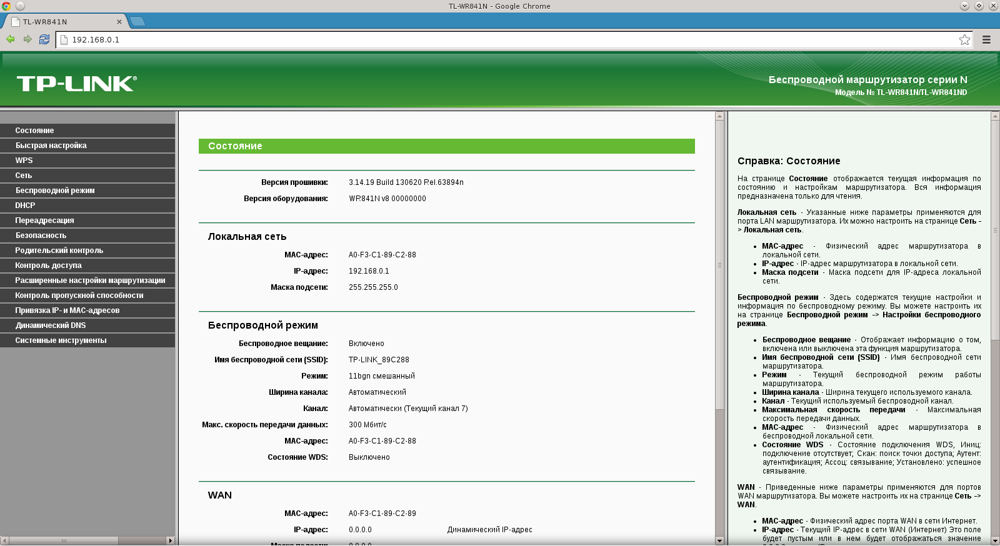

</div>
<div class="fragment fade-in-then-out" style={{ width: "80%" }}>


</div>
<div class="fragment fade-in-then-out" style={{ width: "80%" }}>


</div>
<div class="fragment fade-in-then-out" style={{ width: "80%" }}>


</div>
<div class="fragment fade-in" style={{ width: "80%" }}>


</div>
</div>

</section>
</section>
<section>
<section>

## Key concepts

</section>
<section>

### Browser

- a program through which you access the Internet.

<Relative>
  <Image height="20vh" src={browsers} />
  <Image
    height="20vh"
    position="absolute"
    left="20px"
    src={rip}
    className="fragment"
    data-fragment-index={1}
  />
  <div
    className="fragment"
    data-fragment-index={2}
    style={{
      position: "absolute",
      width: "40%",
      border: "2px solid red",
      height: "100%",
      right: 0,
      top: 0,
      display: "flex",
      justifyContent: "center",
      alignItems: "center",
      fontSize: "2rem",
    }}
  >
    <span style={{ transform: "rotate(30deg)" }}>Still alive 😭</span>
  </div>
</Relative>

<p>
<span className="fragment fade-in-then-out" data-fragment-index={1}>
  Good news
</span>

<span className="fragment fade-in-then-out" data-fragment-index={2}>
  Bad news
</span>
</p>

</section>
<section>

### HTML

- a standardized markup language for web pages on the World Wide Web.

© Wikipedia

</section>
<section>

### HyperText

- text that differs from ordinary text in that it contains [hyperlinks](https://www.w3.org/WhatIs.html) (here


</section>
<section>

### Markup language

<RevealHtmlEditor source={markupDefinition} />

</section>
<section>

<div className="r-stack">

<span>

### HTML Tag

A unit of the HTML language. Tags are used to denote the structure of an HTML document, define its metadata and content.

</span>

<div className="fragment" style={{ width: "80%" }}>


</div>
</div>

</section>
<section>

<div className="r-stack">

<span>

### Bug (software bug)

An error in a program's code that leads to an unexpected result. The term originated in the days when computing machines occupied entire rooms.

Bugs can occur both due to developer errors and as a result of mistakes in development tools.


</span>
<div className="fragment" style={{ width: "80%" }}>

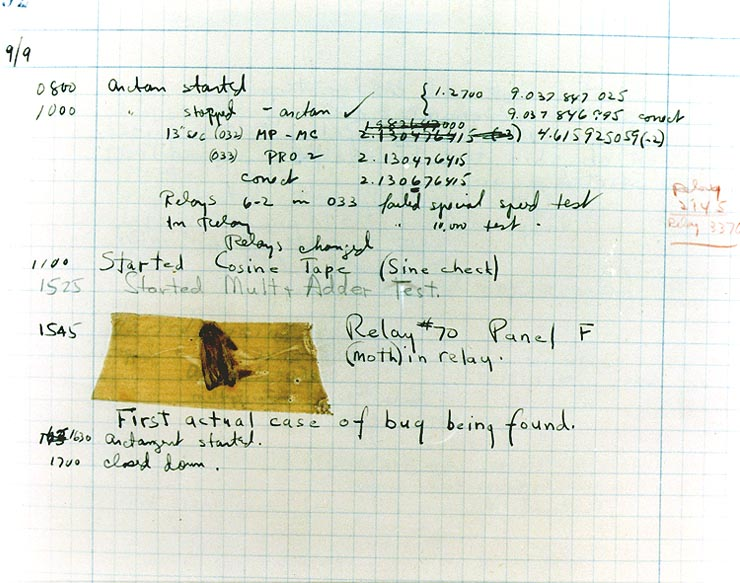

</div>
</div>

</section>
</section>
<section>
<section>

## Getting Started with HTML

</section>
<section>

If we simplify it greatly, the internet is a collection of HTML files that are hosted on special computers called servers.

<p className="fragment">Let's create your first HTML file!</p>

</section>
<section>

<table>
  <thead>
    <tr>
      <th>Action</th>
      <th>🔥 Hotkey / Icon</th>
    </tr>
  </thead>
  <tbody>
    <tr>
      <td>Create a folder my-website</td>
      <td>
        <Hotkey mac={["ctrl", "shift", "N"]} />
      </td>
    </tr>
    <tr>
      <td>Open VSCode</td>
      <td>
        <VSCodeLogo />
      </td>
    </tr>
    <tr>
      <td>Open folder in VSCode</td>
      <td>
        <Hotkey mac={["ctrl", "O"]} />
      </td>
    </tr>
    <tr>
      <td>Create a new file</td>
      <td>
        <Hotkey mac={["ctrl", "N"]} />
      </td>
    </tr>
    <tr>
      <td>Save the empty file</td>
      <td>
        <Hotkey mac={["ctrl", "S"]} />
      </td>
    </tr>
    <tr>
      <td>Name the file index.html</td>
      <td>
        <Hotkey mac={["enter"]} />
      </td>
    </tr>
    <tr>
      <td>A little bit of magic</td>
      <td>
        <Hotkey mac={["!", "tab"]} />
      </td>
    </tr>
  </tbody>
</table>


</section>
<section>

In WEB the first page that is opened to the user to be named <code>index.html</code>.

<a href="https://www.google.com/">google.com</a> === <a href="https://www.google.com/index.html">google.com/index.html</a>
</section>
<section>

To facilitate development, it is recommended to install the LiveReload plugin, which will automatically reload the page every time we save it.

<VSCodeLogo />: <Hotkey mac={["ctrl", "shift", "P"]} /> -> LiveReload: Enable/Disable server

<span style={{ display: "inline-flex" }}>
  <ChromeLogo />: Click on the <ImgIcon src={liveReloadUrl} /> button in the extension panel
</span>

</section>
</section>
<section>
<section>

### Structure of page in HTML 

</section>
<section data-auto-animate>

<AnimatedCode data-id="code-animation">{htmlStructure}</AnimatedCode>

</section>
<section data-auto-animate>

<AnimatedCode data-id="code-animation" lines={[1]}>
  {htmlStructure}
</AnimatedCode>

The `<!DOCTYPE html>` declaration tells the interpreter that HTML version 5 will be used in the document.

</section>
<section data-auto-animate>

<AnimatedCode language="html" data-id="code-animation" lines={[2, 13]}>
  {htmlStructure}
</AnimatedCode>

The `<html>` tag is the opening tag for an HTML document. It is a required root tag. The `lang` attribute specifies the language of the document and is also required.

<Fragment>

The `lang` attribute accepts values in the [BCP47](https://r12a.github.io/app-subtags/) format. It may sound intimidating, but in practice, it is mostly "en" for English. However, if you need to specify another language, you can find or verify its code using the provided link.

</Fragment>

</section>
<section data-auto-animate>

<AnimatedCode data-id="code-animation" numbers="3-9">
  {htmlStructure}
</AnimatedCode>

</section>
<section data-auto-animate>

<AnimatedCode language="html" lines={[3, 9]} data-id="code-animation">
  {htmlStructure}
</AnimatedCode>

The `head` tag contains meta-information for the browser. Here is a [list of tags](https://developer.mozilla.org/en-US/docs/Web/HTML/Element/head) that it can include.

</section>
<section>

```html
<meta />
```

The `meta` tag describes metadata.

[Metadata](https://developer.mozilla.org/en-US/docs/Glossary/Metadata) is data that describes other data. Meta tags heavily depend on the attributes declared within them.

</section>
<section data-auto-animate>

<AnimatedCode data-id="code-animation" numbers="4">
  {htmlStructure}
</AnimatedCode>

</section>
<section data-auto-animate>

<div className="r-stack">
<div data-fragment-index={1} className="fragment fade-out">
<AnimatedCode data-id="code-animation" language="html" lines={[4]}>
  {htmlStructure}
</AnimatedCode>

The `meta` tag specifies the character encoding.

</div>
<div data-fragment-index={1} className="fragment fade-in-then-out" style={{ width: "100%" }}>

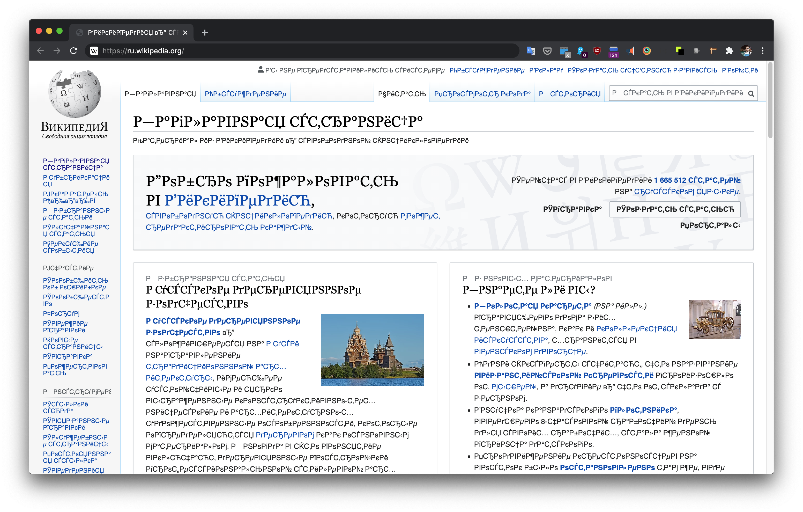

</div>
<div className="fragment" style={{ width: "100%" }}>

Gibberish characters in 99.9% of cases indicate encoding issues.

If gibberish characters appear in the browser, it means the `charset` attribute in the meta tag was incorrectly specified.

If gibberish characters appear in a file, it means either the file was saved with the wrong encoding or it is being read with the wrong encoding.

</div>
</div>

</section>
<section data-auto-animate>

<AnimatedCode data-id="code-animation" numbers="5-7">
  {htmlStructure}
</AnimatedCode>

</section>
<section data-auto-animate>

<AnimatedCode data-id="code-animation" language="html" lines={[5, 6, 7]}>
  {htmlStructure}
</AnimatedCode>


The meta tag responsible for proper display on mobile phones.
In essence, it specifies that the viewport width should be equal to the device width, and the initial scale should not be changed (neither zoomed out nor zoomed in, but set to 1).

</section>
<section data-auto-animate>

<AnimatedCode data-id="code-animation" numbers="8">
  {htmlStructure}
</AnimatedCode>

</section>
<section data-auto-animate>

<AnimatedCode data-id="code-animation" lines={[8]}>
  {htmlStructure}
</AnimatedCode>

The title of the tab. It is very important for search engine optimization.

</section>
<section data-auto-animate>
<AnimatedCode data-id="code-animation" numbers="10-12">
  {htmlStructure}
</AnimatedCode>
</section>
<section data-auto-animate>
<AnimatedCode data-id="code-animation" lines={[10, 11, 12]}>
  {htmlStructure}
</AnimatedCode>

The body tag of the document. It contains the visual content of the HTML document. There can only be one `<body />` tag on a page.

</section>
</section>
<section>
<section>

## Text in HTML

</section>
<section>
  <RevealHtmlEditor source={spaces} />
</section>
<section>
  <table>
    <thead style={{ verticalAlign: "top" }}>
      <tr>
        <th>description</th>
        <th>symbol</th>
        <th>letter code</th>
        <th>numeric code</th>
      </tr>
    </thead>
    <tbody>
      <tr>
        <td>
          <a
            href="https://en.wikipedia.org/wiki/Non-breaking_space"
            target="_blank"
          >
            Non-breaking space
          </a>
        </td>
        <td>&nbsp;</td>
        <td>&amp;nbsp;</td>
        <td>&amp;#160;</td>
      </tr>
      <tr>
        <td>Space</td>
        <td>&#32;</td>
        <td>none 😔</td>
        <td>&amp;#32;</td>
      </tr>
      <tr>
        <td>Ampersand</td>
        <td>&amp;</td>
        <td>&amp;amp;</td>
        <td>&amp;#38;</td>
      </tr>
      <tr>
        <td>
          Less than <i>(less then)</i>
        </td>
        <td>&lt;</td>
        <td>&amp;lt;</td>
        <td>&amp;#60;</td>
      </tr>
      <tr>
        <td>
          Greater than <i>(greater then)</i>
        </td>
        <td>&gt;</td>
        <td>&amp;gt;</td>
        <td>&amp;#62;</td>
      </tr>
    </tbody>
  </table>
</section>
<section>

Full list of [HTML special characters](https://www.freeformatter.com/html-entities.html)

</section>
<section>

Indentations are achieved using the `<p />` tag, which is named after the word "paragraph".

The HTML specification prohibits nesting `<p />` tags inside another `<p />` tag, so indentations within `<p />` are achieved using the `<br />` tag.


</section>
</section>
<section>
<section>

## Headings in HTML

```html
<h1>Heading level 1</h1>
<h2>Heading level 2</h2>
<h3>Heading level 3</h3>
<h4>Heading level 4</h4>
<h5>Heading level 5</h5>
<h6>Heading level 6</h6>
```

</section>
<section>

#### HTML Property No. 0

### HTML allows you to make mistakes

For example, nothing prevents you from having multiple h1 headings on a page, but it is considered that there should be only one.

</section>
</section>
<section>
<section>

## Indentation in HTML

```html
<p>
  Indentation in HTML is achieved using the <p> tag.
</p>
<p>
  Indentation within the <p> tag is created using the <br /> tag.
</p>
```

</section>
<section>

#### HTML Property №1

### Tag Pairing

- Paired tags can contain text within them (such as the `<p></p>` tag).
- Non-paired tags cannot contain text within them (such as the `<br />` tag).


</section>
</section>
<section>
<section>

## Lists in HTML

</section>
<section>

<RevealHtmlEditor source={ul} />

</section>
<section>

<RevealHtmlEditor source={ol} />

</section>
<section>

#### HTML Property No. 2

### Tag Nesting

**Nesting** - the property of tags to contain other tags.

The most important rule of nesting is that the last opened tag should be closed first.

<pre>
  <code data-line-numbers="1|2">{listExampleHtml}</code>
</pre>

</section>
</section>
<section>
<section>

## Links

</section>
<section>

<RevealHtmlEditor source={linkHtml} />

</section>
<section>

#### HTML Property No. 3

### Tag Attributes

An attribute (tag attribute) is an additional property of HTML elements. All HTML elements have common attributes and specific attributes.

All attributes in HTML are treated as strings.

</section>
<section>

The attribute **href** (Hyper REFerence) accepts the URL address of a link.

</section>
</section>
<section>
<section>

## Website deployment

</section>
<section>

<div className="r-stack">

<div data-fragment-index={1} className="fragment fade-out" style={{ width: "100%" }}>

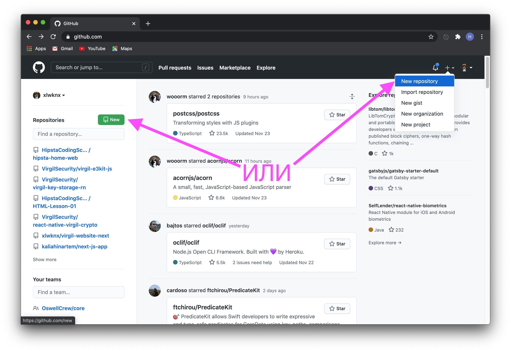

</div>
<div data-fragment-index={1} className="fragment fade-in-then-out" style={{ width: "100%" }}>

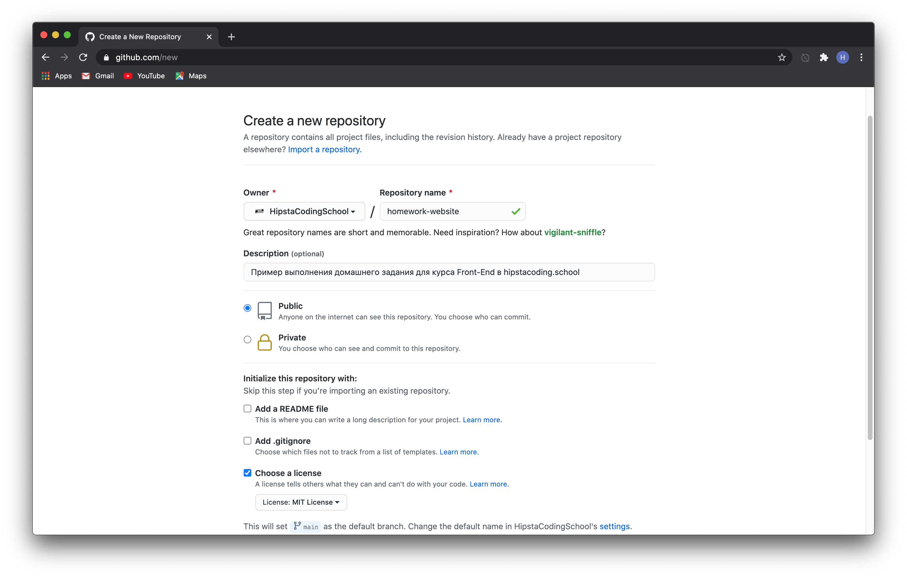

</div>
<div className="fragment fade-in-then-out" width="1431" height="654" style={{ width: "100%" }}>


</div>
<div className="fragment fade-in-then-out"  style={{ width: "90%" }}>

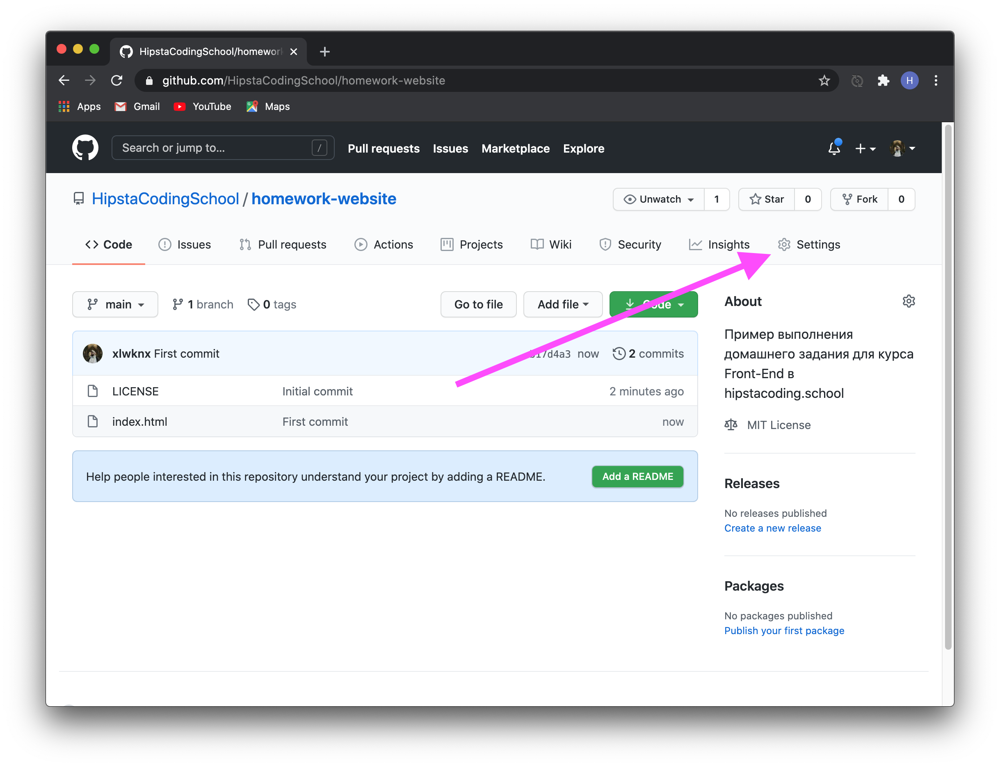

</div>
<div className="fragment fade-in-then-out" style={{ width: "90%" }}>

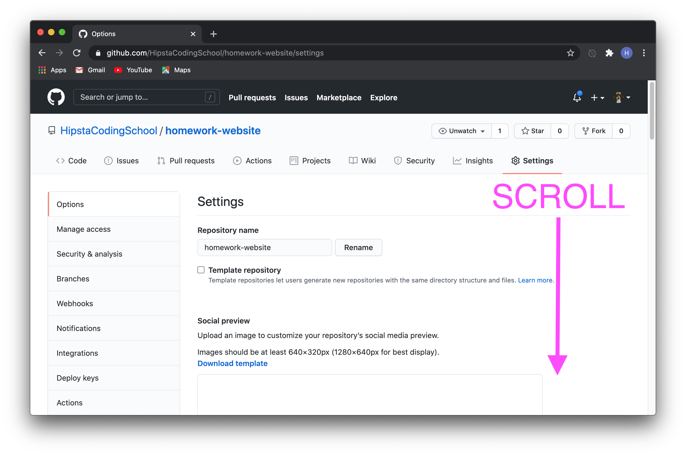

</div>
<div className="fragment fade-in-then-out" style={{ width: "90%" }}>

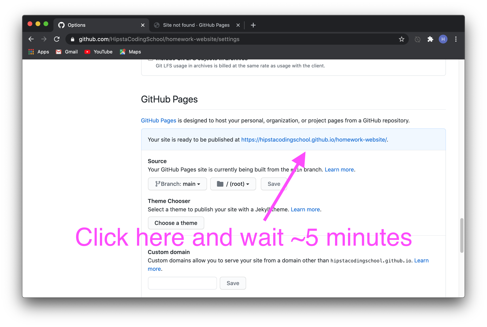

</div>
</div>

</section>
<section data-background={theEnd}>

<audio data-autoplay src="/sounds/temptation-sensation.mp3" />

</section>
</section>
