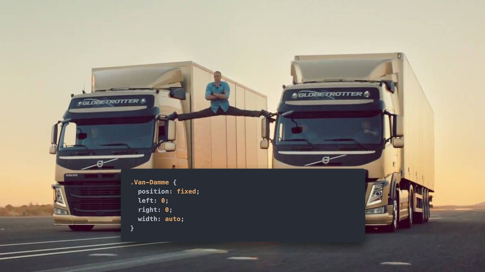

import theEnd from "./images/the-end.png";

<FirstSlide backgroundImg={require("./images/background.jpg")}>
<section>

### Урок 6

---

# Позиционирование


</section>
<section>

1. [[YouTube] Координатная Плоскость](https://www.youtube.com/watch?v=aOhVGfdRtgU)
2. [[Medium] About CSS Positioning](https://medium.com/@demayous1/about-css-positioning-7a913dc7425a)
3. [[MDN] Position](https://developer.mozilla.org/ru/docs/Web/CSS/position)
4. [[MDN] Stacking context](https://developer.mozilla.org/ru/docs/Web/CSS/CSS_Positioning/Understanding_z_index/The_stacking_context)

</section>
</FirstSlide>
<section>
<section>

## Общее позиционирование

</section>
<section>

**Позиционирование** - способ расположения элементов **вне** сетки.

</section>
<section>

### Позиционирование:

- **Распологает** декоративные элементы.
- Добавляет **контекст наложения**.
- **Нарушает** привычный **поток документа**.

</section>
<section data-auto-animate={true}>

### `position`

```css data-id="reverse-cowboy"
.reverse-cowboy {
  position: static; /* default */
  position: relative;
  position: absolute;
  position: fixed;
  position: sticky;
}
```

</section>
<section data-auto-animate>

### Дополнительные свойства

```css data-id="reverse-cowboy"
.reverse-cowboy {
  position: relative;

  top: auto; /* px, rem, %, vh, vw */
  bottom: auto;

  left: auto;
  right: auto;
  z-index: 1: /* integer */
}
```

</section>
<section>

### Свойства <br /> `top, bottom, left, right`

- `top` и `bottom` - отступ по вертикали
- `left` и `right` - отступ по горизонтали
- `top` и `left` - в приоритете
- Игнорируются при `position: static`

</section>
<section>

### Значения <br /> `top, bottom, left, right`

- `auto` - равняется изначальной позиции
- `%` - считается от высоты/ширины родителя
- `px, rem, vh, vw` - могут принимать отрицательные значения

</section>
<section>

<ImgContainer width="80%">



</ImgContainer>

Если `position` равно `absolute` или `fixed`, а элемент может растягиваются - `top` и `bottom`,
`left` и `right` растягивают элемент

</section>
</section>
<section>
<section>

## Относительное позиционирование

#### `position: relative`

</section>
<section>

**Относительное позиционирование** сдвигает элемент относительно его обычного положения.

При этом его предыдущее место в потоке документа остается **зарезервированным**.

</section>
<section>


</section>
<section>

<RevealCssEditor css3={require("./snippets/relative/style.css")} html={require("./snippets/relative/index.html")} />

</section>
<section id="unit-relative">

#### Задача 6.1

### Шахматная доска

Расположить каждую вторую ячейку с помощью `position: relative` так, чтобы образовалась шахматная доска.

</section>
<section>

<RevealCssEditor html={require("./snippets/6-1-unit-relative/index.html")} css3={require("./snippets/6-1-unit-relative/style.css")} />

</section>
<section>

### `position: relative` vs `margin`
<div class="r-stack">
<PassProps className="fragment fade-out" data-fragment-index={0}>

В 95% случаев мы можем обойтись отступом и не использовать `position: relative`,
в том числе использовать отрицательные отступы (negative margins). Особенность
относительного позиционирования - его сдвиг не влияет на другие элементы.

</PassProps>
<PassProps className="fragment fade-in"  data-fragment-index={0}>

Но все же он используется и в паре с `position: absolute`!

<audio data-autoplay src="/sounds/surprise-motherfucker.mp3" />
</PassProps>
</div>

</section>
<section>

#### Пример

<ImgContainer width="80%">


###### Источник: [dribble](https://dribbble.com/shots/9380781-Locatee-Landing-page)

</ImgContainer>

</section>
</section>
<section>
<section>

## Абсолютное позиционирование

#### `position: absolute`

</section>
<section>
<div class="r-stack">
<PassProps className="fragment fade-out" data-fragment-index={1}>

**Абсолютное позиционирование** удаляет элемент из потока и сдвигает относительно экрана или другого
элемента со свойством `position` (не `static`).

</PassProps>
<PassProps className="fragment fade-in" data-fragment-index={1}>

Чаще всего `position: absolute` используют в паре с `position: relative` у родительского элемента 
(контейнера)! 

<audio data-autoplay src="/sounds/surprise-motherfucker.mp3" />
</PassProps>
</div>

</section>
<section>

### Расположение относительно _экрана_

<RevealCssEditor rows={[25, 75]} html={require("./snippets/absolute/index.html")} css3={require("./snippets/absolute/style.css")} />

</section>
<section>

<ImgContainer>


</ImgContainer>

</section>
<section>

### Расположение относительно _родителя_

<RevealCssEditor
  rows={[25, 75]}
  html={require("./snippets/absolute-relative/index.html")}
  css3={require("./snippets/absolute-relative/style.css")}
/>

</section>
<section id="unit-absolute">

#### Задача 6.2

### "В яблочко"

1. Расположить дротик `.dark` в центре дартса c помощью `position: absolute`
2. Раскрасить центр дартса в красный цвет используя `.bullseye`

</section>
<section>

<RevealCssEditor rows={[25, 75]} html={require("./snippets/6-2-unit-absolute/index.html")} css3={require("./snippets/6-2-unit-absolute/style.css")} />

</section>
<section>

### Пример

<ImgContainer width="80%">


###### Источник: [html5up](https://html5up.net/uploads/demos/spectral/#three)

</ImgContainer>

</section>
</section>
<section>
<section>

## Фиксированное позиционирование

#### `position: fixed`

</section>
<section>

**Фиксированное позиционирование** удаляет элемент из потока, сдвигает относительно экрана и 
**фиксирует** его на этом месте

</section>
<section>

<RevealCssEditor html={require("./snippets/fixed/index.html")} css3={require("./snippets/fixed/style.css")} />

</section>
<section>

#### Задача 6.3
### Модальное окно

Разместить модальное окно по центру экрана и затемнить текст за этим окном. Затемнение и центрирование
уже сделанно в `.modal-background`, осталось только правильно его зафиксировать. 

</section>
<section>

<RevealCssEditor html={require("./snippets/6-3-unit-fixed/index.html")} css3={require("./snippets/6-3-unit-fixed/style.css")} />

</section>
<section>

#### Пример

<ImgContainer width="80%">


###### Источник: [html5Up](https://html5up.net/hyperspace)

</ImgContainer>

</section>
</section>
<section>
<section>

## Липкое позиционирование
#### `position: sticky`

</section>
<section>

**Липкое позиционирование** - гибрид относительного и фиксированного позиционирования. Он обрабатывается как относительно позиционированный до тех пор, пока он не пересечет заданный порог, после чего будет считаться фиксированным, пока не достигнет границы его родителя.

</section>
<section>

<RevealCssEditor html={require("./snippets/sticky/index.html")} css3={require("./snippets/sticky/style.css")} />

</section>
</section>
<section>
<section>

## Контекст наложения
#### Stacking Сontext

</section>
<section>

Контекст наложения - это концепция трехмерного расположения HTML элементов вдоль оси Z по отношению к пользователю, находящемуся перед экраном. 

</section>
<section>

<ImgContainer width="80%">


</ImgContainer>

</section>
<section>

<RevealCssEditor html={require("./snippets/stacking-context/index.html")} css3={require("./snippets/stacking-context/style.css")} />

</section>
<section>

Свойство `z-index` определяет порядок отрисовки компонента и принимает значения:

- `auto` (**default**) - не создает внутренний контекст наложения
- `<integer>` - может быть целым положительным и отрицательным числом

</section>
<section>

<RevealCssEditor html={require("./snippets/stacking-custom/index.html")} css3={require("./snippets/stacking-custom/style.css")} />

</section>
<section>

#### Внегласное правило CSS 6.5
### Не использовать z-index

Управлять передним элементом через его порядок и свойством `position`, а `z-index` использовать в
крайнем случае.

</section>
<section>

<RevealCssEditor html={require("./snippets/stacking-order/index.html")} css3={require("./snippets/stacking-order/style.css")} />

</section>
<section>

#### Задача 6.5
## "Играем в дурака"

Ваши карты снизу, карты противника сверху. Нужно "побить" все карты провника.

</section>
<section>

<RevealCssEditor html={require("./snippets/6-5-unit-context/index.html")} css3={require("./snippets/6-5-unit-context/style.css")} />

</section>
</section>
<section>
<section>

#### Домашнее задание 6
## Спозиционируй позиционируемое

Добавь все позиционируемые элементы со своего шаблона к себе на сайт. Если у тебя в шаблоне нету 
таких элементов, добавь что-то из другого шаблона или же придумай задачу сам. 

</section>
<section>

## Есть вопросы?
#### Записывайся на практические занятия в [канале](https://t.me/hipstacodingschool)!

</section>
<section data-background={theEnd}>

<audio data-autoplay src="/sounds/temptation-sensation.mp3" />

</section>
</section>