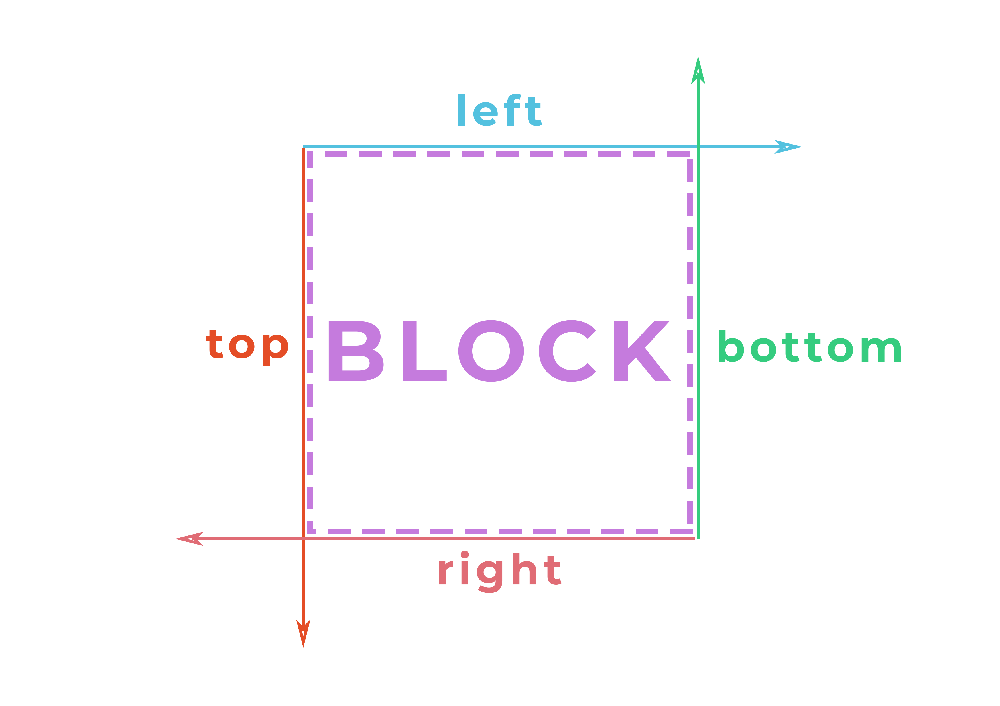

import background from "./images/background.jpg";
import theEnd from "./images/the-end.png";
import relativeHtml from "./snippets/relative/index.html";
import relativeCss from "./snippets/relative/style.css";
import absoluteHtml from "./snippets/absolute/index.html";
import absoluteCss from "./snippets/absolute/style.css";
import absoluteRelativeHtml from "./snippets/absolute-relative/index.html";
import absoluteRelativeCss from "./snippets/absolute-relative/style.css";
import fixedHtml from "./snippets/fixed/index.html";
import fixedCss from "./snippets/fixed/style.css";
import stickyHtml from "./snippets/sticky/index.html";
import stickyCss from "./snippets/sticky/style.css";
import stackingContextHtml from "./snippets/stacking-context/index.html";
import stackingContextCss from "./snippets/stacking-context/style.css";
import stackingCustomHtml from "./snippets/stacking-custom/index.html";
import stackingCustomCss from "./snippets/stacking-custom/style.css";
import stackingOrderHtml from "./snippets/stacking-order/index.html";
import stackingOrderCss from "./snippets/stacking-order/style.css";
import unit61Html from "./snippets/6-1-unit-relative/index.html";
import unit61Css from "./snippets/6-1-unit-relative/style.css";
import unit62Html from "./snippets/6-2-unit-absolute/index.html";
import unit62Css from "./snippets/6-2-unit-absolute/style.css";
import unit63Html from "./snippets/6-3-unit-fixed/index.html";
import unit63Css from "./snippets/6-3-unit-fixed/style.css";
import unit65Html from "./snippets/6-5-unit-context/index.html";
import unit65Css from "./snippets/6-5-unit-context/style.css";

<section
  data-background={background}
  data-background-size="cover"
  data-background-position="top left"
  data-background-opacity={0.1}
>
<section>

### Урок 6

# Позиционирование


</section>
<section>

1. [[Medium] About CSS Positioning](https://medium.com/@demayous1/about-css-positioning-7a913dc7425a)
2. [[MDN] Position](https://developer.mozilla.org/ru/docs/Web/CSS/position)
3. [[MDN] Stacking context](https://developer.mozilla.org/ru/docs/Web/CSS/CSS_Positioning/Understanding_z_index/The_stacking_context)

</section>
</section>
<section>
<section>

## Общее позиционирование

</section>
<section>

- Для декорирования отдельных элементов
- Не для сеток
- Добавляют stacking context
- Нарушают привычный поток документа

</section>
<section>

### `position`

```css
.reverse-cowboy {
  position: static; /* default */
  position: relative;
  position: absolute;
  position: fixed;
  position: sticky;
}
```

</section>
<section>

### `top`, `bottom`, `left`, `right`

```css
.reverse-cowboy {
  position: relative;

  top: auto; /* px, rem, %, vh, vw */
  bottom: auto;

  left: auto;
  right: auto;

  z-index: 1: /* integer */
}
```

</section>
<section>

### `top`, `bottom`, `left`, `right`

- Значение `auto` равняется изначальной позиции
- Значение в `%` считается от высоты/ширины родителя
- Могут принимать отрицательные значения
- Игнорируются при отсуствии свойства `position` и его значения `static`

</section>
<section>

### `top` и `left` в приоритете

- если `position` равно `absolute` или `fixed`, а элемент может растягиваются - `top` и `bottom`,
  `left` и `right` растягивают элемент
- `top` и `bottom` - отступ от начальной точки по вертикали (ось y)
- `left` и `right` - отступ от начальной точки по горизонтали (ось x)

</section>
</section>
<section>
<section>

## Относительное позиционирование

#### `position: relative;`

</section>
<section>

_Относительное позиционирование_ сдвигает элемент относительно его обычного положения.

При этом его предыдущее место в потоке документа остается **зарезервированным**.

</section>
<section>



</section>
<section>

<RevealCssEditor css3={relativeCss} html={relativeHtml} />

</section>
<section id="unit-relative">

#### Задача 6.1

### Шахматная доска

Расположить каждую вторую ячейку с помощью `position: relative;` так, чтобы образовалась шахматная доска.

</section>
<section>

<RevealCssEditor html={unit61Html} css3={unit61Css} />

</section>
<section>

### `position: relative` vs `margin`

<div class="r-stack">
<PassProps className="fragment fade-out" data-fragment-index={0}>
 
В 95% случаев мы можем обойтись отступом и не использовать `position: relative`,
в том числе использовать отрицательные отступы (negative margins). Особенность
относительного позиционирования - его сдвиг не влияет на другие элементы.

</PassProps>
<PassProps className="fragment fade-in" data-fragment-index={0}>

Но все же он используется и в паре с `position: absolute`!

<audio data-autoplay src="/sounds/surprise-motherfucker.mp3" />
</PassProps>
</div>

</section>
<section>

#### Пример

<ImgContainer width="80%">


###### Источник: [dribble](https://dribbble.com/shots/9380781-Locatee-Landing-page)

</ImgContainer>

</section>
</section>
<section>
<section>

## Абсолютное позиционирование

#### `position: absolute`

</section>
<section>

<div class="r-stack">
<PassProps className="fragment fade-out" data-fragment-index={0}>

**Абсолютное позиционирование** удаляет элемент из потока и сдвигает относительно экрана или другого
элемента со свойством `position` (не `static`).

</PassProps>
<PassProps className="fragment fade-in" data-fragment-index={0}>

Чаще всего `position: absolute` используют в паре с `position: relative` у родительского элемента 
(контейнера)! 

<audio data-autoplay src="/sounds/surprise-motherfucker.mp3" />
</PassProps>
</div>

</section>
<section>

### Расположение относительно _экрана_

<RevealCssEditor rows={[25, 75]} html={absoluteHtml} css3={absoluteCss} />

</section>
<section>

<ImgContainer>


</ImgContainer>

</section>
<section>

### Расположение относительно _родителя_

<RevealCssEditor
  rows={[25, 75]}
  html={absoluteRelativeHtml}
  css3={absoluteRelativeCss}
/>

</section>
<section id="unit-absolute">

#### Задача 6.2

### "В яблочко"

1. Расположить дротик `.dark` в центре дартса c помощью `position: absolute`
2. Раскрасить центр дартса в красный цвет используя `.bullseye`

</section>
<section>

<RevealCssEditor rows={[25, 75]} html={unit62Html} css3={unit62Css} />

</section>
<section>

### Пример

<ImgContainer width="80%">


###### Источник: [html5up](https://html5up.net/uploads/demos/spectral/#three)

</ImgContainer>

</section>
</section>
<section>
<section>

## Фиксированное позиционирование

#### `position: fixed`

</section>
<section>

**Фиксированное позиционирование** удаляет элемент из потока, сдвигает относительно экрана и 
**фиксирует** его на этом месте

</section>
<section>

<RevealCssEditor html={fixedHtml} css3={fixedCss} />

</section>
<section>

#### Задача 6.3
### Модальное окно

Разместить модальное окно по центру экрана и затемнить текст за этим окном. Затемнение и центрирование
уже сделанно в `.modal-background`, осталось только правильно его зафиксировать. 

</section>
<section>

<RevealCssEditor html={unit63Html} css3={unit63Css} />

</section>
<section>

#### Пример

<ImgContainer width="80%">


###### Источник: [html5Up](https://html5up.net/hyperspace)

</ImgContainer>

</section>
</section>
<section>
<section>

## Липкое позиционирование
#### `position: sticky`

</section>
<section>

**Липкое позиционирование** - гибрид относительного и фиксированного позиционирования. Он обрабатывается как относительно позиционированный до тех пор, пока он не пересечет заданный порог, после чего будет считаться фиксированным, пока не достигнет границы его родителя.

</section>
<section>

<RevealCssEditor html={stickyHtml} css3={stickyCss} />

</section>
</section>
<section>
<section>

## Контекст наложения
#### Stacking Сontext

</section>
<section>

Контекст наложения - это концепция трехмерного расположения HTML элементов вдоль оси Z по отношению к пользователю, находящемуся перед экраном. 

</section>
<section>

<ImgContainer width="80%">


</ImgContainer>

</section>
<section>

<RevealCssEditor html={stackingContextHtml} css3={stackingContextCss} />

</section>
<section>

Свойство `z-index` определяет порядок отрисовки компонента и принимает значения:

- `auto` (**default**) - не создает внутренний контекст наложения
- `<integer>` - может быть целым положительным и отрицательным числом

</section>
<section>

<RevealCssEditor html={stackingCustomHtml} css3={stackingCustomCss} />

</section>
<section>

#### Внегласное правило CSS 6.5
### Не использовать z-index

Управлять передним элементом через его порядок и свойством `position`, а `z-index` использовать в
крайнем случае.

</section>
<section>

<RevealCssEditor html={stackingOrderHtml} css3={stackingOrderCss} />

</section>
<section>

#### Задача 6.5
## "Играем в дурака"

Ваши карты снизу, карты противника сверху. Нужно "побить" все карты провника.

</section>
<section>

<RevealCssEditor html={unit65Html} css3={unit65Css} />

</section>
</section>
<section>
<section>

#### Домашнее задание 6
## Спозиционируй позиционируемое

Добавь все позиционируемые элементы со своего шаблона к себе на сайт. Если у тебя в шаблоне нету 
таких элементов, добавь что-то из другого шаблона или же придумай задачу сам. 

</section>
<section>

## Есть вопросы?
#### Записывайся на практические занятия в [канале](https://t.me/hipstacodingschool)!

</section>
<section data-background={theEnd}>

<audio data-autoplay src="/sounds/temptation-sensation.mp3" />

</section>
</section>